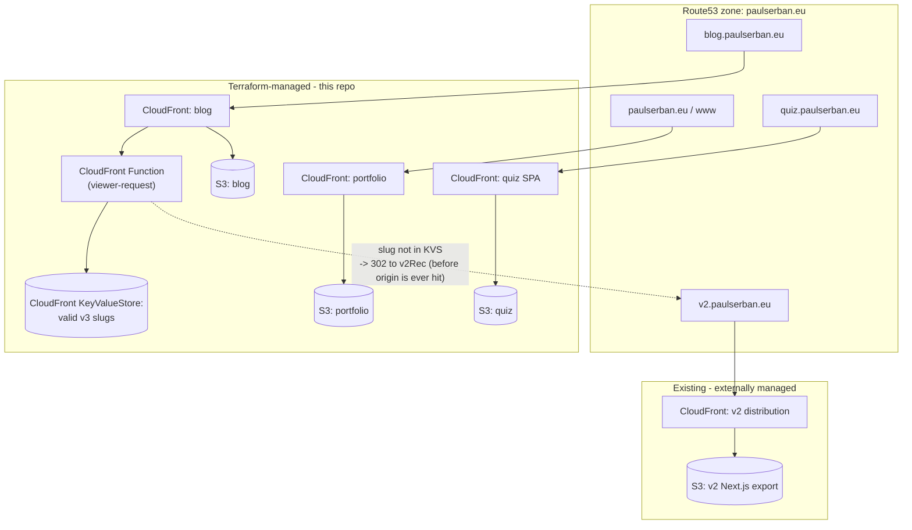

# AWS Hosting for v3 + v2 Legacy Redirect

## Context

- v3 currently only deploys to GitHub Pages for DEV (`.github/workflows/deploy-dev.yaml`), with sub-path routing (`/home/`, `/blog/`, `/quiz/`). No AWS infra exists in-repo (`infrastructure/readme.md` is a generic best-practices essay; no Terraform/CDK anywhere).
- Draft ADRs (`_docs/architectural-knowledge-management/architectural-decision-log/_drafts/adr-000--hosting.md`, `adr-000--deployment-architecture.md`, `adr-000--ci-cd.md`) proposed Cloudflare Pages — **superseded** by this plan since the user requires AWS S3+CloudFront (matching v2 and the existing caching spike at `_docs/.../adr-000--caching-strategy/spikes/01 cloudfront caching.md`).
- Blog visibility today: [frontend/sites/blog-site/src/lib/queries/posts.ts](frontend/sites/blog-site/src/lib/queries/posts.ts) gates every listing/detail route through `publishedQuestionPostSlugs()` — a post is only built in v3 if it has ≥1 published row in `questions` (FK `questions.post_slug -> posts.slug`, see `shared/db-schema/index.ts:74-168`). Everything else (the bulk of the ~900 v2 posts) simply doesn't exist as a page in v3.
- Legacy v2 routes (from `_docs/02 plans/blog_site_implementation.md`): singular, prefixed paths — `/blog/post/{slug}`, `/blog/snippet/{slug}`, `/blog/booknote/{slug}`. v3 mirrors these unprefixed at the blog subdomain root: `/post/{slug}/`, `/snippet/{slug}/`, `/booknote/{slug}/` (`trailingSlash: 'always'` in `astro.config.mjs`).
- Production domains are already assumed in code: `frontend/sites/blog-site/src/lib/urls.ts`, `frontend/sites/portfolio-site/src/lib/urls.ts`, `frontend/apps/quiz-web-app/src/lib/urls.ts`, and `shared/navigation/src/urls.ts` (`portfolio.paulserban.eu` apex, `blog.paulserban.eu`, `quiz.paulserban.eu`). No app-code changes needed for domains — this plan is purely infra/CI.
- Per your answers: **Terraform** for IaC, **v2's AWS infra already exists and stays externally managed** (this repo only wires DNS + the redirect target), and the redirect uses a **CloudFront Function + KeyValueStore** (cost analysis below ruled out Lambda@Edge — 6x more expensive per request plus compute-duration charges and slow us-east-1/versioned-ARN propagation, for logic simple enough to run in <1ms). The valid-slug list needs no manual maintenance: it's generated at deploy time from the same `getAllSlugs()` query Astro already uses, so it auto-adapts as posts gain/lose questions — no dependency on knowing v2's full inventory.

## Architecture



Only the blog distribution needs redirect logic; portfolio and quiz are self-contained. Unlike an origin-based check, the CloudFront Function runs on `viewer-request`, so a redirect for a missing post never even reaches the S3 origin.

## 1. Terraform layout (new)

```
infrastructure/
  aws/
    bootstrap/                 # one-time, applied manually first
      main.tf                  # S3 state bucket + DynamoDB lock table
    modules/
      static-site/             # reusable: S3 (private, OAC) + CloudFront + ACM (us-east-1) + Route53 alias
        main.tf variables.tf outputs.tf
      blog-redirect-function/   # CloudFront Function (viewer-request) + KeyValueStore
        main.tf variables.tf
        src/redirect.js
    envs/
      prod/
        backend.tf              # S3 backend from bootstrap
        providers.tf            # aws provider + us-east-1 alias for ACM/Lambda@Edge
        main.tf                 # instantiate static-site x3 + blog-redirect-function + v2 alias record
        variables.tf            # domain_name, hosted_zone_id, v2_cloudfront_domain_name
        outputs.tf               # bucket names + distribution IDs (consumed by CI)
```

- `pnpm-workspace.yaml` already globs `infrastructure/*`; Terraform files don't need a `package.json`, they just live alongside the existing `infrastructure/readme.md`.
- ACM certs for CloudFront must be in `us-east-1` regardless of S3 bucket region — use a provider alias, DNS-validated against the existing Route53 hosted zone (`data "aws_route53_zone"`, assumed already delegated for `paulserban.eu`).
- `static-site` module per site: private S3 bucket (block all public access) + Origin Access Control, CloudFront distribution (default root object `index.html`), cache behaviors per the existing caching spike (`/assets/*` and other hashed paths: 1yr immutable; HTML: `max-age=0, must-revalidate`), Route53 `A`/`AAAA` alias record.
    - Quiz distribution additionally needs a custom error response mapping 403/404 -> `/index.html` (200) for SPA client-side routing (replaces the GitHub Pages `404.html` sessionStorage hack, which stays untouched in `deploy-dev.yaml` for DEV).

## 2. Redirect mechanism — CloudFront Function + KeyValueStore on the blog distribution

**Why not Lambda@Edge:** Lambda@Edge costs $0.60/1M requests + compute-duration charges (vs $0.10/1M flat for CloudFront Functions, no compute charge, 2M/month free tier) and requires `us-east-1`-only deployment with versioned ARNs that take minutes to propagate on every change. The redirect logic here is trivial (one lookup, one conditional), well within CloudFront Functions' 1ms/2MB-memory limits, so there's no reason to pay the Lambda@Edge premium or take on its operational overhead.

**Mechanism:** a CloudFront **KeyValueStore** holds the full set of valid v3 slugs (regenerated on every deploy from the same `getAllSlugs()` query Astro already runs for `getStaticPaths()` — no separate/manual list). A `viewer-request` CloudFront Function checks the incoming path against it and redirects immediately, before ever touching the S3 origin.

`infrastructure/aws/modules/blog-redirect-function/src/redirect.js`:

```javascript
import cf from 'cloudfront';

const kvsHandle = cf.kvs();

async function handler(event) {
    const request = event.request;
    const match = request.uri.match(/^\/(post|snippet|booknote)\/([^/]+)\/?$/);

    if (!match) {
        return request; // not a post-detail path (asset, listing, etc.) - pass through
    }

    const [, type, slug] = match;

    try {
        await kvsHandle.get(`${type}/${slug}`); // throws if key not found
        return request; // valid v3 slug - let it reach the origin
    } catch {
        return {
            statusCode: 302,
            statusDescription: 'Found',
            headers: {
                location: { value: `https://v2.paulserban.eu/blog/${type}/${slug}` },
                'cache-control': { value: 'no-cache' },
            },
        };
    }
}
```

- Terraform: `aws_cloudfront_key_value_store` + `aws_cloudfront_function` (runtime `cloudfront-js-2.0`, associated via the KVS), wired to the blog `aws_cloudfront_distribution`'s default cache behavior via `function_association { event_type = "viewer-request" }`. CloudFront Functions deploy near-instantly (no versioned-ARN propagation delay like Lambda@Edge).
- CI step (in the prod deploy workflow, part of the blog build) exports the valid slug list (type/slug pairs from `getAllSlugs()`) and calls `aws cloudfront-keyvaluestore put-key` (or a bulk `update-keys` call) to sync the KVS after each content deploy — same cadence as the S3 sync, no manual list maintenance.
- **Open assumption to verify before implementing**: v2's live URL pattern is `/blog/{post|snippet|booknote}/{slug}` under `v2.paulserban.eu` (carried over unchanged from today's `paulserban.eu/blog/...`). Confirm against the actual v2 site before wiring the redirect target.

## 3. v2.paulserban.eu (externally managed infra)

Since v2's S3/CloudFront already exists and is managed outside this repo, this repo's Terraform only needs v2's **existing CloudFront distribution domain name** as an input variable to create the Route53 alias:

```hcl
resource "aws_route53_record" "v2" {
  zone_id = data.aws_route53_zone.root.zone_id
  name    = "v2.paulserban.eu"
  type    = "A"
  alias {
    name                   = var.v2_cloudfront_domain_name
    zone_id                = "Z2FDTNDATAQYW2" # CloudFront's fixed hosted zone id
    evaluate_target_health = false
  }
}
```

The following remain **manual runbook steps** (documented in the new ADR, not Terraform, since they touch a distribution outside this repo's state):

1. Add `v2.paulserban.eu` as an alternate domain name (CNAME) on v2's existing CloudFront distribution.
2. Ensure/extend that distribution's ACM cert to cover `v2.paulserban.eu` (new cert or added SAN).
3. Confirm the apex `paulserban.eu`/`www` DNS currently pointing at v2 will be safely repointed to the new v3 portfolio distribution once this Terraform is applied (Route53 record replacement, since the hosted zone is shared and DNS itself isn't "v2 infra").

## 4. CI/CD changes

- New workflow `.github/workflows/deploy-prod.yaml` (leave `deploy-dev.yaml`/GitHub Pages untouched for DEV):
    - Reuses the existing ingest pattern from `deploy-dev.yaml` (checkout, `setup-monorepo`, `pnpm db:migrate`, `pnpm start`) to produce `content.db` + quiz JSON.
    - Builds each app with **root-relative** env vars (no `/home`, `/blog`, `/quiz` sub-paths, since each is now its own subdomain): `ASTRO_SITE=https://paulserban.eu` / `ASTRO_BASE=/`, `ASTRO_SITE=https://blog.paulserban.eu` / `ASTRO_BASE=/`, `VITE_APP_BASE=/`.
    - Deploy step per site: `aws s3 sync dist/ s3://<bucket> --delete` with `--cache-control` split between hashed assets (1yr immutable) and HTML (`max-age=0, must-revalidate`) per the caching spike, then `aws cloudfront create-invalidation --paths "/*.html" "/*"` scoped appropriately.
    - Blog deploy additionally syncs the valid-slug list into the CloudFront KeyValueStore (`aws cloudfront-keyvaluestore ...`) so the redirect function's data matches the just-published content.
    - AWS auth via GitHub OIDC (`aws-actions/configure-aws-credentials` assuming a deploy role) — no long-lived AWS keys as repo secrets.
    - Bucket names / distribution IDs sourced from Terraform `outputs.tf` (either committed as a small values file after `terraform apply`, or looked up via SSM Parameter Store written by Terraform).
- Terraform apply itself runs as a separate, manually-triggered (or infra-path-filtered) workflow — infra changes shouldn't run on every content push.

## 5. Documentation updates

- Add `_docs/architectural-knowledge-management/architectural-decision-log/adr-010--hosting-and-deployment.md` accepting AWS S3 + CloudFront + Terraform + CloudFront Function/KeyValueStore redirect, explicitly superseding the Cloudflare-based drafts (`_drafts/adr-000--hosting.md`, `adr-000--deployment-architecture.md`, `adr-000--ci-cd.md` — mark as superseded, don't delete). Include the Lambda@Edge-vs-CloudFront-Functions cost tradeoff as the rationale.
- Update `_docs/architectural-knowledge-management/01 architecture document.md` deployment section to reflect the real multi-distribution AWS layout and the v2 redirect contract.
- Update `_docs/AGENTS.md` implementation-status table (CI/CD row) once this lands.

## Todos

</plan>
<todos>[{"id":"tf-bootstrap","content":"Create Terraform bootstrap (S3 state bucket + DynamoDB lock table) under infrastructure/aws/bootstrap/"},{"id":"tf-static-site-module","content":"Build reusable static-site Terraform module (S3 + OAC + CloudFront + ACM us-east-1 + Route53 alias) under infrastructure/aws/modules/static-site/"},{"id":"tf-envs-prod","content":"Instantiate the module 3x (portfolio, blog, quiz) plus the v2.paulserban.eu alias record in infrastructure/aws/envs/prod/"},{"id":"redirect-function","content":"Implement blog-redirect-function module (CloudFront Function + KeyValueStore, viewer-request redirect to v2.paulserban.eu) and attach to the blog CloudFront distribution"},{"id":"redirect-ci-sync","content":"Add CI step to sync the valid-slug list into the CloudFront KeyValueStore on each blog deploy"},{"id":"verify-v2-url-pattern","content":"Confirm v2's live URL pattern (/blog/{type}/{slug}) before finalizing the redirect target construction"},{"id":"v2-runbook","content":"Document manual runbook steps for adding v2.paulserban.eu alternate domain + ACM SAN on v2's existing CloudFront distribution"},{"id":"ci-prod-workflow","content":"Add .github/workflows/deploy-prod.yaml: root-relative builds, OIDC AWS auth, S3 sync with cache-control split, CloudFront invalidation"},{"id":"docs-adr","content":"Add ADR accepting AWS/Terraform/CloudFront Function hosting decision, superseding Cloudflare drafts, and update architecture doc + AGENTS.md status table"}]
