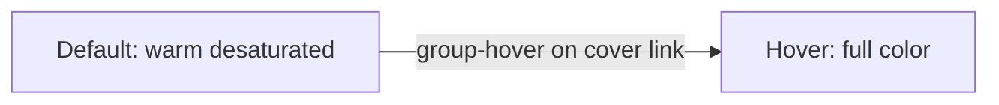

# Newspaper-tinted card covers with hover color

## Scope (confirmed)

Listing cards only — [`PostCard.astro`](frontend/sites/blog-site/src/core/library/modules/PostCard/PostCard.astro) and [`PostCardReact.tsx`](frontend/sites/blog-site/src/core/library/modules/PostCard/PostCardReact.tsx). Detail-page hero covers in [`HeroBanner.astro`](frontend/sites/blog-site/src/core/library/modules/HeroBanner.astro) stay full color.

## Approach

Use a **blog-local CSS class** rather than long Tailwind arbitrary filter strings duplicated in two components. The effect should feel like aged newsprint (warm, slightly desaturated), not harsh black-and-white:

```css
filter: grayscale(0.85) sepia(0.18) saturate(0.8);
```

On hover of the cover link (`group` / `a:hover`), reset to `filter: none` with a short ease transition.



## Implementation

### 1. Add component class in [`global.css`](frontend/sites/blog-site/src/styles/global.css)

Inside the existing `@layer components` block:

```css
.post-card-cover-img {
    filter: grayscale(0.85) sepia(0.18) saturate(0.8);
    transition: filter 0.3s ease;
}
.group:hover .post-card-cover-img {
    filter: none;
}
```

Optional dark-mode tweak (slightly less sepia so it doesn't look muddy on `--newsprint: #14130f`):

```css
.dark .post-card-cover-img {
    filter: grayscale(0.8) sepia(0.1) saturate(0.75);
}
```

### 2. Update [`PostCard.astro`](frontend/sites/blog-site/src/core/library/modules/PostCard/PostCard.astro)

- Add `group` to the cover anchor: `class="group mb-3 block overflow-hidden"`
- Extend `imgClassName` on `CoverImage`:

```astro
imgClassName="post-card-cover-img aspect-video w-full object-cover"
```

### 3. Update [`PostCardReact.tsx`](frontend/sites/blog-site/src/core/library/modules/PostCard/PostCardReact.tsx)

Mirror the same two changes so the interactive listing island (`PostListIsland`) matches static cards pixel-for-pixel.

No changes to shared `CoverImage` — keeps the effect blog-specific and avoids impacting the quiz app or other consumers.

## Verification

1. `pnpm typecheck` in blog-site.
2. Visual check on hub (`/`), `/post/`, and one tag page:
    - Cover images appear warm/desaturated (not stark B&W).
    - Hovering the cover link restores full color smoothly.
    - Cards without covers unchanged.
3. Toggle dark mode — covers should still look muted, not muddy.

## Out of scope

- HeroBanner / detail pages (per your choice).
- Changing shared `CoverImage` or `theme.css` globally.
