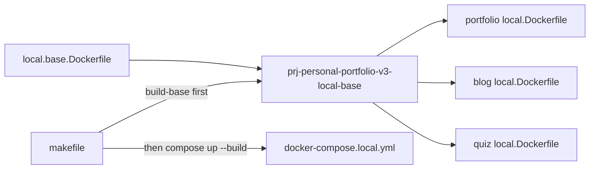

# Centralize Local Dockerfiles

## Brutal Honesty

The three app Dockerfiles are almost pure copy-paste. The shared part is not subtle: `node:24-alpine`, Alpine build deps, `/app`, Corepack/pnpm, root workspace metadata, `shared`, `tools`, and the filtered `pnpm install` pattern are repeated three times.

The one trap: **do not put all app source into the base image**. That would technically centralize more, but it would make every app source change invalidate the shared base and force all local images to rebuild from the expensive layer. The clean split is:

- Root base image: common OS/runtime/workspace/shared/tooling layers.
- App images: copy only the app directory, install only that filtered workspace package, expose the right port, run the app-specific dev server.

Also: Docker Compose does **not reliably solve “build this Dockerfile image first, then use it as `FROM` in three other builds”**. The Makefile must own that ordering.

## Current Duplication

These files are currently near-identical:

- [frontend/sites/portfolio-site/local.Dockerfile](frontend/sites/portfolio-site/local.Dockerfile)
- [frontend/sites/blog-site/local.Dockerfile](frontend/sites/blog-site/local.Dockerfile)
- [frontend/apps/quiz-web-app/local.Dockerfile](frontend/apps/quiz-web-app/local.Dockerfile)

Only these values differ:

- App path: `frontend/sites/portfolio-site`, `frontend/sites/blog-site`, `frontend/apps/quiz-web-app`
- Package filter name
- Exposed port: `4321` for Astro, `5180` for Vite
- Dev command: `astro dev` vs `vite`

## Target Structure



## Implementation Plan

### 1. Add root [local.base.Dockerfile](local.base.Dockerfile)

Create a base image at repo root with the shared layers:

```dockerfile
# Local monorepo base image — build context: monorepo root
FROM node:24-alpine

RUN apk add --no-cache python3 make g++ libc6-compat

WORKDIR /app

RUN corepack enable && corepack prepare pnpm@11.5.0 --activate

COPY package.json pnpm-workspace.yaml pnpm-lock.yaml tsconfig.json tsconfig.base.json ./
COPY shared ./shared
COPY tools ./tools
```

This deliberately stops before app source copy and `pnpm install`, because the filter target differs per app and copying all app source into base would make rebuilds worse.

### 2. Convert app Dockerfiles to thin children

Each app Dockerfile should use the built base image:

```dockerfile
ARG LOCAL_BASE_IMAGE=prj-personal-portfolio-v3-local-base:latest
FROM ${LOCAL_BASE_IMAGE}
```

Then keep only the app-specific pieces.

Portfolio:

```dockerfile
COPY frontend/sites/portfolio-site ./frontend/sites/portfolio-site
RUN pnpm install --frozen-lockfile \
    --filter @prj--personal-portfolio--v3/frontend--portfolio-site...
EXPOSE 4321
CMD ["pnpm", "--filter", "@prj--personal-portfolio--v3/frontend--portfolio-site", "exec", "astro", "dev", "--host", "0.0.0.0", "--port", "4321"]
```

Blog mirrors portfolio with `frontend--blog-site`.

Quiz:

```dockerfile
COPY frontend/apps/quiz-web-app ./frontend/apps/quiz-web-app
RUN pnpm install --frozen-lockfile \
    --filter @prj--personal-portfolio--v3/frontend--quiz-web-app...
EXPOSE 5180
CMD ["pnpm", "--filter", "@prj--personal-portfolio--v3/frontend--quiz-web-app", "exec", "vite", "--host", "0.0.0.0", "--port", "5180"]
```

### 3. Update [infrastructure/local/docker-compose.local.yml](infrastructure/local/docker-compose.local.yml)

For each frontend service build block, pass the base image name as a build arg:

```yaml
build:
  context: ../..
  dockerfile: frontend/sites/blog-site/local.Dockerfile
  args:
    LOCAL_BASE_IMAGE: prj-personal-portfolio-v3-local-base:latest
```

This makes the dependency explicit in Compose config, but the image must still be built first by the Makefile.

### 4. Update [makefile](makefile)

Add named variables to avoid repeating the compose file path and base image name:

```make
COMPOSE_FILE := infrastructure/local/docker-compose.local.yml
LOCAL_BASE_IMAGE := prj-personal-portfolio-v3-local-base:latest
```

Add a base build target:

```make
local_base_build:
	docker build -f local.base.Dockerfile -t $(LOCAL_BASE_IMAGE) .
```

Make `compose_up` depend on it:

```make
compose_up: local_base_build
	docker compose -f $(COMPOSE_FILE) up --build
```

Update `compose_down` and `compose_down_clean` to use `$(COMPOSE_FILE)`.

Optional but useful targets:

- `compose_build`: builds base, then app images without starting containers.
- `compose_up_service`: documented command remains `docker compose ... up --build portfolio`; do not overcomplicate with parameterized Make syntax unless the repo already uses it.

### 5. Verification

Run:

```bash
make local_base_build
docker compose -f infrastructure/local/docker-compose.local.yml build portfolio blog quiz
docker compose -f infrastructure/local/docker-compose.local.yml config
```

Then smoke boot:

```bash
make compose_up
```

Expected outcomes:

- Base image builds once.
- Portfolio and blog still expose `4321` internally.
- Quiz still exposes `5180` internally.
- Traefik labels remain unchanged.
- Local URLs still route:
  - `https://local.paulserban.eu`
  - `https://local.blog.paulserban.eu`
  - `https://local.quiz.paulserban.eu`

## Out of Scope

- Production Dockerfiles (none are involved here).
- Reworking local development to bind-mount source into containers. That would be a separate workflow decision.
- Updating older documentation unless requested. The docs currently say each app has a local Dockerfile; that remains true, though they will now inherit from a root base image.