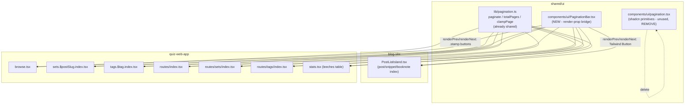

# Cross-app shared pagination

## Brutally honest starting assessment

Two parts of the original ask are **already done** from a prior session (not reflected in git status because it landed earlier) — verified by reading the actual code, not assuming:

- `shared/ui/src/lib/pagination.ts` already exports `paginate`, `totalPages`, `clampPage`, wired up via `"./pagination"` in [`shared/ui/package.json`](shared/ui/package.json).
- Both apps already import it: [`frontend/sites/blog-site/src/core/library/widgets/PostListIsland.tsx:6`](frontend/sites/blog-site/src/core/library/widgets/PostListIsland.tsx) and [`frontend/apps/quiz-web-app/src/routes/browse.tsx:7`](frontend/apps/quiz-web-app/src/routes/browse.tsx).
- This matches the (already-executed) plan at [`_docs/02 plans/blog-listing-pagination.md`](<_docs/02 plans/blog-listing-pagination.md>), whose frontmatter still says `status: pending` on all 3 todos even though the code shows all 3 are actually implemented — that doc is stale, not the code.

So "the math" is not the gap. The real gaps, found by reading every route file:

1. **Quiz-web-app has pagination on exactly one route** (`/browse`, 25/page, local inline `Pagination` function at [`browse.tsx:272-313`](frontend/apps/quiz-web-app/src/routes/browse.tsx)). Five other list views render **everything, unbounded**:
    - [`routes/index.tsx`](frontend/apps/quiz-web-app/src/routes/index.tsx) — full posts catalogue grid
    - [`routes/sets/index.tsx`](frontend/apps/quiz-web-app/src/routes/sets/index.tsx) — study-set grid
    - [`routes/sets.$postSlug.index.tsx:357`](frontend/apps/quiz-web-app/src/routes/sets.$postSlug.index.tsx) — per-post questions table
    - [`routes/tags/index.tsx`](frontend/apps/quiz-web-app/src/routes/tags/index.tsx) — tag list
    - [`routes/tags.$tag.index.tsx:136`](frontend/apps/quiz-web-app/src/routes/tags.$tag.index.tsx) — per-tag questions table
    - [`routes/stats.tsx:362`](frontend/apps/quiz-web-app/src/routes/stats.tsx) — leeches table
2. **Today's actual data volume is small** (18 posts, ≤35 questions/post — checked via `posts.json`). Nothing here is a live performance emergency; this is about **consistency and future-proofing**, not fixing lag. Worth saying plainly so the effort is scoped honestly.
3. **The prior plan explicitly rejected a shared UI pagination component**, only sharing math, because blog (Tailwind `Button` on a card grid) and quiz (custom `.stamp` CSS-var buttons on data tables) are visually incompatible. That reasoning was correct **at the time**, but you've now chosen to force a shared component anyway across both apps — which means the component **must** bridge two incompatible visual systems via render props/slots, not hardcode one theme. Accepting that added indirection is a real trade-off, not free.
4. **Dead code found**: `shared/ui/src/components/ui/pagination.tsx` (shadcn `Pagination`/`PaginationLink`/`PaginationPrevious`/etc., anchor-based) is exported from the package barrel (`shared/ui/index.ts:31`) but **imported by nobody**. It doesn't fit the render-prop design either (it's link-based, assumes real navigation). Removing it avoids a naming collision with the new component and deletes unused weight.
5. One "everything" candidate does **not** actually fit "pagination": `stats.tsx`'s "Card Type Distribution" section iterates `addedPosts` to render a bar-chart-per-set, not a list of items to page through. Paginating a report is form over function — excluded, called out explicitly rather than silently skipped.

## Architecture



## The shared component

New file `shared/ui/src/components/ui/PaginationBar.tsx`, exported via a new `"./pagination-bar"` subpath (parallel to the existing `"./pagination"` math export). It owns **behavior + copy + a11y**, not visuals:

```tsx
export interface PaginationBarProps {
    page: number;
    pages: number;
    total: number;
    onPageChange: (page: number) => void;
    itemLabel?: string; // e.g. "questions" — defaults to "total"
    className?: string;
    labelClassName?: string;
    renderPrev: (state: { disabled: boolean; onClick: () => void }) => React.ReactNode;
    renderNext: (state: { disabled: boolean; onClick: () => void }) => React.ReactNode;
}
```

- Renders **nothing** when `pages <= 1` (unifies blog's existing behavior; fixes quiz `browse.tsx` currently always rendering "Page 1 of 1" pointlessly).
- Computes `disabled` for prev/next itself; consumers only supply the themed button element.
- Owns the "Page X of Y · N total" text node; consumers pass `labelClassName` for their own typography instead of the component guessing a shared token that doesn't exist yet (blog uses Tailwind `text-slate-ink`, quiz uses inline `color: var(--slate)` — these are not unified today, and unifying design tokens is out of scope here).

Consumers plug in their own button:

- Blog: `renderPrev={({ disabled, onClick }) => <Button variant="outline" size="sm" disabled={disabled} onClick={onClick}>← Prev</Button>}`
- Quiz: `renderPrev={({ disabled, onClick }) => <button className="stamp stamp-ghost text-sm disabled:opacity-40" disabled={disabled} onClick={onClick}>← Prev</button>}`

**Removed as part of this work**: `shared/ui/src/components/ui/pagination.tsx` (shadcn primitives) and its `export *` line in `shared/ui/index.ts:31` — unused, incompatible with the render-prop design, and would otherwise collide on the `Pagination` export name.

## Page-size convention (applied consistently)

| View shape                                                                                                                    | Page size | Rationale                                      |
| ----------------------------------------------------------------------------------------------------------------------------- | --------- | ---------------------------------------------- |
| Card grids (`index.tsx`, `sets/index.tsx`)                                                                                    | 12        | Matches blog's existing grid precedent         |
| Tables / dense lists (`browse.tsx`, `sets.$postSlug.index.tsx`, `tags.$tag.index.tsx`, `tags/index.tsx`, `stats.tsx` leeches) | 25        | Matches quiz's existing `browse.tsx` precedent |

## Consistency fix bundled in

`browse.tsx` currently resets `page` to 1 only via a `useEffect` on `filters` and never calls `clampPage` — if `filters` state didn't change but the underlying data shrank (e.g. a post removed), page could stay out of range. Every consumer in this plan (including the refactored `browse.tsx`) will route the current page through `clampPage(page, pages)` before slicing, matching blog's existing safety behavior.

## Explicit non-goals (to keep this bounded)

- **No URL sync for quiz routes.** Blog's `?page=` sync already exists and is untouched. Adding `?page=` to five quiz routes would mean either hand-rolled `history.replaceState` (blog's approach) or TanStack Router typed search params (the "proper" way here, since quiz already uses `@tanstack/react-router`). That's a meaningfully bigger, separate change — flagging it as a good follow-up, not silently bundling it in.
- **No design-token unification** between blog's Tailwind classes and quiz's CSS vars. `labelClassName`/render props sidestep this rather than solve it.
- **`stats.tsx` "Card Type Distribution"** stays unpaginated — it's a per-set report, not a browsable list.

## Todos

1. Add `PaginationBar` to `shared/ui` (component + `"./pagination-bar"` export); delete the unused shadcn `pagination.tsx` primitives and their barrel export.
2. Refactor `browse.tsx` (quiz) to use `PaginationBar` + `clampPage`, replacing the local `Pagination` function — behavior-neutral.
3. Refactor `PostListIsland.tsx` (blog) to use `PaginationBar`, replacing its inline Prev/Next block — behavior-neutral (page size, URL sync, reset-on-filter all unchanged).
4. Add pagination (25/page) to `sets.$postSlug.index.tsx` questions table.
5. Add pagination (25/page) to `tags.$tag.index.tsx` questions table.
6. Add pagination (12/page) to `routes/index.tsx` posts catalogue grid.
7. Add pagination (12/page) to `routes/sets/index.tsx` study-set grid.
8. Add pagination (25/page) to `routes/tags/index.tsx` tag list.
9. Add pagination (25/page) to `stats.tsx` leeches table.
10. Typecheck + test both apps (`pnpm -F shared--ui typecheck`, `pnpm -F frontend--quiz-web-app typecheck && test`, `pnpm -F blog-site build`/`astro check`); manual pass on all touched routes (prev/next disabled states, page counts, empty states, reset-on-filter where applicable).
