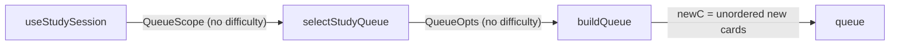
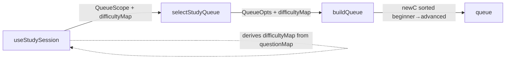

# Sort New Cards by Difficulty (Beginner → Advanced)

## Context

- `Difficulty = 'beginner' | 'intermediate' | 'advanced'` lives in [`shared/question-contract/index.ts`](shared/question-contract/index.ts)
- `ExportedQuestion.difficulty` is the content field; `CardState` (scheduling) has no difficulty field
- `buildQueue` in [`src/algorithms/queue.ts`](frontend/apps/quiz-web-app/src/algorithms/queue.ts) currently does **no sort** on the `newC` bucket: `cards.filter((c) => c.cardType === "new").slice(0, newLimit)`
- `questionMap: Map<slug, ExportedQuestion>` is available in [`src/hooks/useStudySession.ts`](frontend/apps/quiz-web-app/src/hooks/useStudySession.ts)

## Data flow (existing)



## Data flow (after change)



## Changes

### 1. [`src/algorithms/queue.ts`](frontend/apps/quiz-web-app/src/algorithms/queue.ts)

Add `difficultyMap?: Map<string, number>` to `QueueOpts`. Before `.slice(0, newLimit)`, sort `newC` ascending by difficulty rank (missing slug → rank 2 / intermediate):

```ts
const DIFFICULTY_RANK: Record<string, number> = { beginner: 1, intermediate: 2, advanced: 3 };

// inside buildQueue, replace the newC line:
const newC = cards
    .filter((c) => c.cardType === 'new')
    .sort((a, b) => {
        const ra = opts.difficultyMap?.get(a.questionSlug) ?? 2;
        const rb = opts.difficultyMap?.get(b.questionSlug) ?? 2;
        return ra - rb;
    })
    .slice(0, newLimit);
```

The sort is a stable ascending sort so ties preserve relative insertion order. Slicing after sorting ensures the daily new-card budget also favours beginner cards.

### 2. [`src/store/selectors.ts`](frontend/apps/quiz-web-app/src/store/selectors.ts)

- Add `difficultyMap?: Map<string, number>` to `QueueScope`
- Thread it into each `buildQueue` call: `difficultyMap: scope.difficultyMap`
- Update `sortCramQueue` to also sort the `newC` bucket by difficulty (same logic, same map passed as arg)

### 3. [`src/hooks/useStudySession.ts`](frontend/apps/quiz-web-app/src/hooks/useStudySession.ts)

Derive `difficultyMap` from `questionMap` in a `useMemo`. Pass it into the existing `selectStudyQueue` call via `QueueScope.difficultyMap`:

```ts
const difficultyMap = useMemo(() => {
    const rank: Record<string, number> = { beginner: 1, intermediate: 2, advanced: 3 };
    const map = new Map<string, number>();
    for (const [slug, q] of questionMap) {
        map.set(slug, rank[q.difficulty] ?? 2);
    }
    return map;
}, [questionMap]);
```

Add `difficultyMap` to the `queue` useMemo deps array and pass it as `difficultyMap` in the scope object passed to `selectStudyQueue`.

### 4. [`src/algorithms/queue.test.ts`](frontend/apps/quiz-web-app/src/algorithms/queue.test.ts)

Add a test that verifies new cards appear beginner → intermediate → advanced when a `difficultyMap` is provided, and that the natural/mixed order is preserved when no map is given.

## What this achieves

- A deck of 30 questions (mixed difficulty) will have new cards surfaced in the order: beginner, intermediate, advanced
- If the daily new-card cap allows only N new cards, the N easiest ones are introduced first
- A beginner new card always appears before any advanced new cards still waiting — satisfying the "beginner gets priority" requirement
- Learning (in-progress) and review buckets are unaffected — only the `new` bucket is sorted
- All changes are backward-compatible: `difficultyMap` is optional; without it the queue behaves exactly as before
