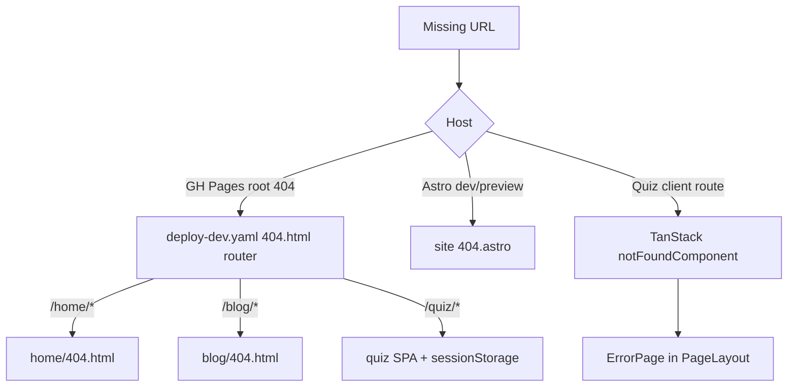

# Error Pages for Portfolio, Blog, and Quiz

## Problem

| App | Current behavior |
|-----|------------------|
| [portfolio-site](frontend/sites/portfolio-site/) | No `404.astro` — Astro/host default |
| [blog-site](frontend/sites/blog-site/) | No `404.astro` — Astro/host default |
| [quiz-web-app](frontend/apps/quiz-web-app/) | Root `notFoundComponent` / `errorComponent` exist but use shadcn tokens (`bg-background`) **outside** `PageLayout` — looks unlike the rest of the app |
| [deploy-dev.yaml](.github/workflows/deploy-dev.yaml) | Root `_site/404.html` only handles quiz SPA deep-links; `/home/*` and `/blog/*` misses show plain `"Page not found."` |

Static Astro sites cannot serve runtime `500.astro` pages (`output: 'static'`). Scope is **404 pages** for Astro + **404 + runtime error UI** for the quiz SPA.

## Target design

All three apps share the same newspaper layout pattern already used elsewhere:

- Masthead/header + footer chrome
- `font-display` headline, `kicker` label, `rule-thin` divider
- `stamp` / `stampClasses` CTA back to home
- `bg-newsprint text-ink` palette



## Step 1 — Shared React `ErrorPage` block

Add [`shared/ui/src/components/blocks/ErrorPage.tsx`](shared/ui/src/components/blocks/ErrorPage.tsx):

```tsx
interface ErrorPageProps {
  code?: string;        // "404" | "Error"
  title: string;
  message: string;
  homeHref: string;
  homeLabel?: string;   // default "Back home"
}
```

Newspaper-styled centered content (no layout chrome — parent supplies `PageLayout` or Astro shell). Export from [`shared/ui/src/components/blocks/index.ts`](shared/ui/src/components/blocks/index.ts).

## Step 2 — Astro `404.astro` for portfolio-site and blog-site

Add [`frontend/sites/portfolio-site/src/pages/404.astro`](frontend/sites/portfolio-site/src/pages/404.astro) and [`frontend/sites/blog-site/src/pages/404.astro`](frontend/sites/blog-site/src/pages/404.astro).

Each page:
- Wraps content in existing [`BaseTemplate.astro`](frontend/sites/portfolio-site/src/core/system/templates/BaseTemplate.astro) (header/footer included)
- Sets `title="Page not found | Paul Serban"` and a short `description`
- Mirrors the `ErrorPage` visual structure in plain Astro/HTML (no React island — zero JS on 404)
- Links home via each site's `siteUrls.home` from [`urls.ts`](frontend/sites/portfolio-site/src/lib/urls.ts)

Astro emits `404.html` at each site's dist root (e.g. `_site/home/404.html` after deploy merge).

**Do not** add `[...slug].astro` catch-alls — they conflict with Astro's special `404.html` output.

## Step 3 — Quiz-web-app: restyle 404 and error handlers

Update [`frontend/apps/quiz-web-app/src/routes/__root.tsx`](frontend/apps/quiz-web-app/src/routes/__root.tsx):

- Import `ErrorPage` from `shared--ui/blocks` and `PageLayout` from `@/components/layout/PageLayout`
- Replace inline `NotFoundComponent` and `ErrorComponent` with:

```tsx
<PageLayout>
  <ErrorPage code="404" title="Page not found" message="…" homeHref="/" />
</PageLayout>
```

- Use `stampClasses`-style home link via `ErrorPage` (or `Link` from TanStack Router inside `ErrorPage`)
- `ErrorComponent`: same layout, code omitted, title "This page didn't load", include a home link (currently missing)

No new route file needed — root `notFoundComponent` / `errorComponent` already catch unmatched paths and thrown errors.

## Step 4 — Update GitHub Pages deploy 404 router

In [`.github/workflows/deploy-dev.yaml`](.github/workflows/deploy-dev.yaml), extend the root `_site/404.html` inline script (lines 189–201):

1. **`/quiz/*`** — keep existing `sessionStorage` SPA redirect
2. **`/home/*`** — `location.replace(b + '/home/404.html')`
3. **`/blog/*`** — `location.replace(b + '/blog/404.html')`
4. **fallback** — redirect to `/home/404.html`

This ensures GH Pages' single root `404.html` delegates to each site's branded page.

## Step 5 — Verify

- `pnpm --filter frontend--portfolio-site build` → confirm `dist/404.html` exists
- `pnpm --filter frontend--blog-site build` → confirm `dist/404.html` exists
- `pnpm --filter frontend--quiz-web-app typecheck`
- Manually hit unknown routes in each app's dev server

## Files changed

| File | Change |
|------|--------|
| `shared/ui/src/components/blocks/ErrorPage.tsx` | **new** shared presentation block |
| `shared/ui/src/components/blocks/index.ts` | export `ErrorPage` |
| `frontend/sites/portfolio-site/src/pages/404.astro` | **new** |
| `frontend/sites/blog-site/src/pages/404.astro` | **new** |
| `frontend/apps/quiz-web-app/src/routes/__root.tsx` | use `PageLayout` + `ErrorPage` |
| `.github/workflows/deploy-dev.yaml` | route root 404 to sub-site pages |

## Out of scope

- Runtime `500.astro` (requires SSR adapter)
- Per-route `throw notFound()` for invalid quiz post/tag slugs (separate enhancement)
- Vite `preview` SPA fallback middleware (dev already works; production uses GH Pages script)
