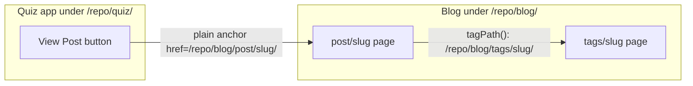

# Fix broken cross-app and base-path links on GitHub Pages

## Root cause of the reported bug

The "View Post" button is in the quiz app, [frontend/apps/quiz-web-app/src/routes/index.tsx](frontend/apps/quiz-web-app/src/routes/index.tsx) (lines 190-199 and 212-221). It renders the blog URL with TanStack Router's `<Link to={blogHref}>`:

```191:198:frontend/apps/quiz-web-app/src/routes/index.tsx
<Link
  to={blogHref}
  params={{ postSlug: post.slug }}
  className={stampClasses("ghost", "sm")}
  title={`View the ${post.title} blog post`}
>
  View Post
</Link>
```

On GitHub Pages, `blogPostUrl()` correctly returns `/prj--personal-portfolio--v3/blog/post/<slug>/`, but TanStack Router treats `to` as an internal route and prepends its `basepath` (`/prj--personal-portfolio--v3/quiz`), producing the doubled URL `.../quiz/prj--personal-portfolio--v3/blog/post/...`. Blog URLs are external to the router and must be plain `<a>` tags (as every other page in the quiz app already does).

## All issues found

### Quiz app

1. **`routes/index.tsx`** — both "View Post" `<Link>`s (added and not-added branches) must become plain `<a href={blogHref} target="_blank" rel="noopener noreferrer">`, consistent with the "Read source post" links elsewhere. The `params={{ postSlug }}` prop is meaningless there and gets dropped.
2. **`routes/sets.$postSlug.index.tsx` line 170** — `{...externalLinkAttrs}` spreads the *function itself* (a no-op; it adds zero attributes). `externalLinkAttrs(href)` is a function in [shared/navigation/src/urls.ts](shared/navigation/src/urls.ts). Since the title says "opens in a new tab" and the target is a different app, replace with explicit `target="_blank" rel="noopener noreferrer"`.

### Blog site — root-relative links that ignore `BASE_URL`

On GitHub Pages the blog is served under `/prj--personal-portfolio--v3/blog/` (`ASTRO_BASE` in [.github/workflows/deploy-dev.yaml](.github/workflows/deploy-dev.yaml)), but these links hardcode `/`-rooted paths and 404:

3. **`postDetailPath()`** in [frontend/sites/blog-site/src/lib/urls.ts](frontend/sites/blog-site/src/lib/urls.ts) returns `/${segment}/${slug}/` without the base. This breaks every PostCard link AND makes `canonicalUrl` in [PostTemplate.astro](frontend/sites/blog-site/src/core/system/templates/PostTemplate.astro) wrong (`new URL('/post/…', origin)` drops `/prj--…/blog`). Fix: `return `${base}${DETAIL_SEGMENT[type]}/${slug}/`;` (Vite guarantees `BASE_URL` ends with `/`). The canonical URL fixes itself once the path includes the base.
4. **Tag links** — `/tags/${tag.slug}/` is hardcoded in [TagList.astro](frontend/sites/blog-site/src/core/library/components/TagList.astro) (line 18) and [PostCardReact.tsx](frontend/sites/blog-site/src/core/library/modules/PostCard/PostCardReact.tsx) (line 46). Add `tagPath(slug: string)` to `lib/urls.ts` and use it in both.
5. **Hub page section links** — `viewAllHref: '/post/'`, `'/snippet/'`, `'/booknote/'` in [frontend/sites/blog-site/src/pages/index.astro](frontend/sites/blog-site/src/pages/index.astro) (lines 17, 24, 31). Replace with `siteUrls.post`, `siteUrls.snippet`, `siteUrls.booknote` which are already base-aware.
6. **Placeholder cover** — `PLACEHOLDER_COVER = '/placeholder-cover.png'` in [HeroBanner.astro](frontend/sites/blog-site/src/core/library/modules/HeroBanner.astro) (line 15). Use the existing `assetUrl('placeholder-cover.png')` helper.

Header/footer navigation, 404 page, and the sitemap link already use base-aware `siteUrls`/`assetUrl` and need no changes.



## Verification

1. `pnpm typecheck` for blog-site; `pnpm --filter ...frontend--quiz-web-app typecheck`.
2. Build blog-site with a Pages-like base (`ASTRO_BASE=/prj--personal-portfolio--v3/blog ASTRO_SITE=https://paulalexserban.github.io pnpm build`) and grep `dist/` HTML to confirm card hrefs, tag hrefs, view-all hrefs, canonical URLs, and placeholder image all carry the base prefix.
3. Build quiz app with `VITE_APP_BASE=/prj--personal-portfolio--v3/quiz` and confirm the built JS no longer routes blog hrefs through the router (View Post renders as an `<a>` with the blog path only).
