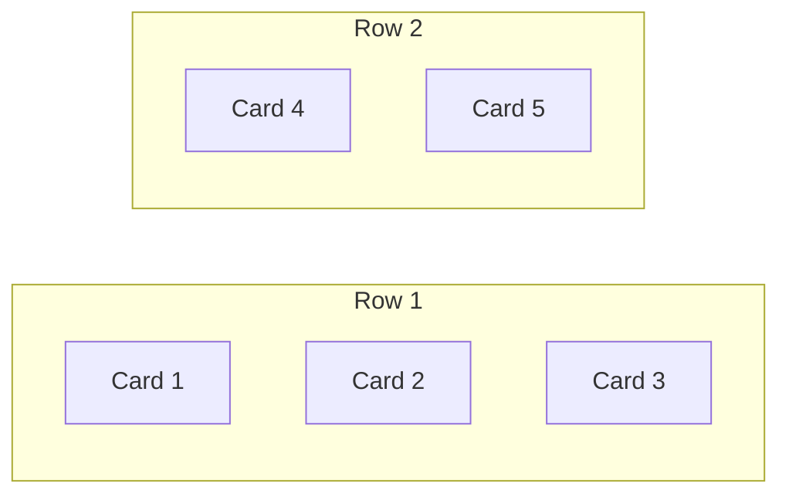

# Fix snippet listing column distribution (2-2-1 not 2-1-2)

## Root cause

Listing grids use Tailwind **CSS columns** (`columns-1 sm:columns-2 lg:columns-3`) in `[PostListIsland.tsx](frontend/sites/blog-site/src/core/library/widgets/PostListIsland.tsx)`:

```169:174:frontend/sites/blog-site/src/core/library/widgets/PostListIsland.tsx
<ul className="m-0 list-none columns-1 gap-5 p-0 sm:columns-2 lg:columns-3">
    {pageItems.map((post) => (
        <li key={post.slug} className="mb-5 break-inside-avoid">
```

CSS multi-column layout fills **down each column first** and, with the default `column-fill: balance`, redistributes items by **height** to even out columns. With 5 cards of uneven height (long titles, varying tag counts), the browser ends up with **2 · 1 · 2** — exactly what your screenshot shows.

What you want is **row-first reading order** on a 3-column page:




Vertical counts per column: **2 · 2 · 1**.

## Fix

Switch from `columns-*` to **CSS grid** with the same breakpoints. G2rid places items in DOM order left-to-right, top-to-bottom — matching expected reading order.

**Before:** `columns-1 gap-5 sm:columns-2 lg:columns-3` + `break-inside-avoid` + `mb-5` on `<li>`

**After:** `grid grid-cols-1 gap-5 sm:grid-cols-2 lg:grid-cols-3` on `<ul>`; drop `break-inside-avoid` and per-item `mb-5` (grid `gap-5` handles spacing).

### Files to update (same class change in all three)


| File                                                                                                                                           | Used on                                                 |
| ---------------------------------------------------------------------------------------------------------------------------------------------- | ------------------------------------------------------- |
| `[frontend/sites/blog-site/src/core/library/widgets/PostListIsland.tsx](frontend/sites/blog-site/src/core/library/widgets/PostListIsland.tsx)` | Snippets / Posts / Book Notes listing pages (paginated) |
| `[frontend/sites/blog-site/src/pages/index.astro](frontend/sites/blog-site/src/pages/index.astro)`                                             | Hub pinned sections                                     |
| `[frontend/sites/blog-site/src/pages/tags/[tag].astro](frontend/sites/blog-site/src/pages/tags/[tag].astro)`                                   | Tag archive sections                                    |


Optional DRY: add a shared utility in `[frontend/sites/blog-site/src/styles/global.css](frontend/sites/blog-site/src/styles/global.css)`, e.g. `.post-list-grid`, and use it in all three places — keeps listing/hub/tag layouts in sync.

## Trade-off (intentional)

Grid rows align to the tallest card in each row; shorter cards leave empty space below within that row instead of masonry-style packing. That is the correct trade-off for predictable **2-2-1** (and generally even left-to-right) ordering.

## Verification

- Open `/snippet/` (or GitHub Pages equivalent) with 5+ items on page 1 at `lg` width — columns should read **2 · 2 · 1** top-to-bottom.
- Confirm order: card 1 top-left, card 2 top-center, card 3 top-right, card 4 second row left, card 5 second row center.
- Spot-check hub (`/`) pinned snippets and a tag page for the same layout.
- Resize to `sm` (2 cols) and mobile (1 col) — no regressions.

