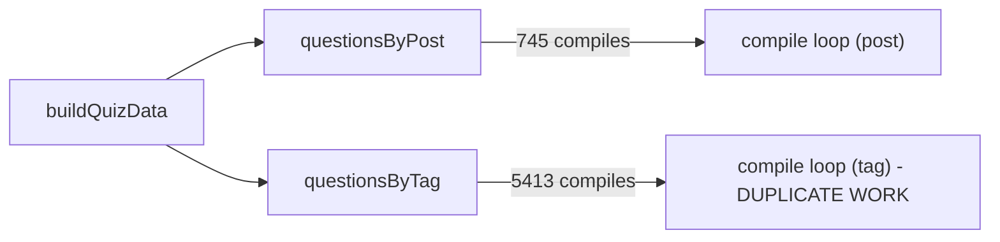

## Root cause (confirmed against real data)

`database/output/content.db` has 745 published questions and 5,413 `question_tags` rows (~7.17 tags/question). [`compileQuizData`](tools/quiz-export/src/compile.ts) in [`tools/quiz-export/src/compile.ts`](tools/quiz-export/src/compile.ts) independently calls `compileQuestion()` once per post-group entry (745 calls) **and again** once per tag-group entry (5,413 calls) — 6,158 total calls to compile 745 unique questions, since `questionsByPost` and `questionsByTag` reference the same underlying question objects (built in [`tools/quiz-export/src/export.ts`](tools/quiz-export/src/export.ts)). Each call runs a full remark/rehype pipeline + DOMPurify sanitize per field (stem, explanation, each option label) and re-copies referenced images from disk. The DB queries themselves are fast bulk selects on a `better-sqlite3` connection and are not the bottleneck.



## Fix: compile once per unique slug, reuse everywhere

### 1. Rewrite `compileQuizData` in [`tools/quiz-export/src/compile.ts`](tools/quiz-export/src/compile.ts)

Replace the two independent loops with:

- Collect unique questions across `questionsByPost` values into a `Map<string, ExportedQuestion>` keyed by `slug`.
- Compile each unique question exactly once (`Promise.all` over the unique set — still not true CPU concurrency, but at minimum the right amount of work).
- Build a `compiledBySlug: Map<string, ExportedQuestion>` from the results.
- Reconstruct `questionsByPost` and `questionsByTag` by mapping each original list's entries through `compiledBySlug.get(slug)!`, preserving key order and per-group array contents/order exactly as before.

Example shape:

```ts
export async function compileQuizData(data: QuizData, opts: CompileOptions = {}): Promise<QuizData> {
    const uniqueQuestions = new Map<string, ExportedQuestion>();
    for (const list of data.questionsByPost.values()) {
        for (const q of list) uniqueQuestions.set(q.slug, q);
    }

    const compiledEntries = await Promise.all([...uniqueQuestions.values()].map(async (q) => [q.slug, await compileQuestion(q, opts)] as const));
    const compiledBySlug = new Map(compiledEntries);

    const remap = (list: ExportedQuestion[]) => list.map((q) => compiledBySlug.get(q.slug)!);

    return {
        ...data,
        questionsByPost: new Map([...data.questionsByPost].map(([k, list]) => [k, remap(list)])),
        questionsByTag: new Map([...data.questionsByTag].map(([k, list]) => [k, remap(list)])),
    };
}
```

This drops total `compileQuestion` calls from ~6,158 to 745 (an ~8.27x reduction) and eliminates redundant asset copies for the same reason.

### 2. Parallelize file writes in [`tools/quiz-export/src/write.ts`](tools/quiz-export/src/write.ts)

Replace the sequential `for (...) { await writeFile(...) }` loops (question files and tag files) with `Promise.all` over `Object.entries`/map, matching the existing `Promise.all` pattern already used for directory creation at the top of the function. Keep `questionFilePaths`/`tagFilePaths` ordering by building them from the map keys before/independently of the write promises.

### 3. Tests

- Extend [`tools/quiz-export/src/compile.test.ts`](tools/quiz-export/src/compile.test.ts) with a case asserting a question that appears in both `questionsByPost` and multiple `questionsByTag` entries is only compiled once — e.g. spy/count invocations of the underlying compile function (or assert referential/deep equality of `stemHtml` across groupings) to lock in the dedup behavior and prevent regression.
- No changes needed to `export.test.ts` (grouping logic there is unaffected).

## Verification

- `pnpm --filter @prj--personal-portfolio--v3/tools--quiz-export test`
- Run the export locally with timing: `time pnpm --filter @prj--personal-portfolio--v3/tools--quiz-export start` (or equivalent script) before/after to confirm wall-clock improvement.
- Spot check a couple of `public/data/tags/<slug>.json` and `public/data/questions/<postSlug>.json` outputs to confirm `stemHtml`/`explanationHtml`/`labelHtml` content is unchanged (byte-identical HTML) after the refactor — this is a pure performance fix, not a behavior change.

## Out of scope (mentioned for awareness, not included)

- Incremental/content-hash caching across export runs (would avoid recompiling unchanged questions between runs entirely) — a bigger change, worth a separate follow-up if export time is still unacceptable after this fix.
- Any DB schema/index changes — not needed; the queries are not the bottleneck.
