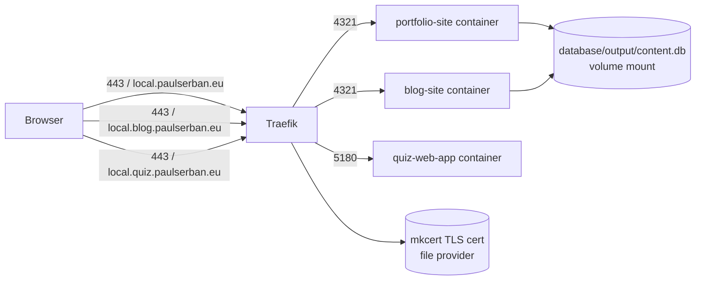

# Local Docker + Traefik Infrastructure

## Architecture



HTTP (port 80) redirects to HTTPS (port 443) via Traefik entrypoint redirect. Traefik routes by `Host` header so both Astro containers can expose port 4321 internally without collision.

## Files to create

### Dockerfiles (build context = monorepo root, needed for pnpm workspace deps)

- [`frontend/sites/portfolio-site/local.Dockerfile`](frontend/sites/portfolio-site/local.Dockerfile) — Node 22-alpine, installs workspace deps, runs `astro dev --host --port 4321`
- [`frontend/sites/blog-site/local.Dockerfile`](frontend/sites/blog-site/local.Dockerfile) — same pattern, same port (own container namespace)
- [`frontend/apps/quiz-web-app/local.Dockerfile`](frontend/apps/quiz-web-app/local.Dockerfile) — Node 22-alpine, runs `vite --host --port 5180`

Each Dockerfile copies: root workspace files (`package.json`, `pnpm-workspace.yaml`, `pnpm-lock.yaml`, root `tsconfig.json`) + `shared/` packages + the target app directory. The `content.db` is **not** baked in — it is bind-mounted at runtime.

### Infrastructure

- [`infrastructure/local/docker-compose.local.yml`](infrastructure/local/docker-compose.local.yml) — defines `traefik`, `portfolio`, `blog`, `quiz` services on a shared bridge network; portfolio/blog mount `../../database/output` read-only so `shared--db` resolves the default path `database/output/content.db`
- [`infrastructure/local/traefik/traefik.yml`](infrastructure/local/traefik/traefik.yml) — static config: entrypoints `web:80→websecure`, `websecure:443`; providers: docker + file (`/etc/traefik/dynamic`); API dashboard (insecure, local only)
- [`infrastructure/local/traefik/dynamic/tls.yml`](infrastructure/local/traefik/dynamic/tls.yml) — references mkcert cert/key at `/certs/local.pem` and `/certs/local-key.pem`
- [`infrastructure/local/traefik/certs/.gitkeep`](infrastructure/local/traefik/certs/.gitkeep) — placeholder; certs go here (gitignored)
- [`infrastructure/local/.gitignore`](infrastructure/local/.gitignore) — ignores `traefik/certs/*.pem`

### Docs

- [`_docs/infrastructure/local-dev-setup--macos.md`](_docs/infrastructure/local-dev-setup--macos.md) — Homebrew, Docker Desktop, mkcert, `/etc/hosts`, `docker compose` commands
- [`_docs/infrastructure/local-dev-setup--debian.md`](_docs/infrastructure/local-dev-setup--debian.md) — Docker Engine + Compose plugin, mkcert binary, `/etc/hosts`, `docker compose` commands

## Key technical details

**mkcert cert generation** (run once on host, outputs into `infrastructure/local/traefik/certs/`):

```bash
mkcert -cert-file infrastructure/local/traefik/certs/local.pem \
       -key-file  infrastructure/local/traefik/certs/local-key.pem \
       local.paulserban.eu local.blog.paulserban.eu local.quiz.paulserban.eu
```

**`/etc/hosts` entries** (both OS docs):

```
127.0.0.1  local.paulserban.eu
127.0.0.1  local.blog.paulserban.eu
127.0.0.1  local.quiz.paulserban.eu
```

**DB path** — `shared/db/src/connection.ts` accepts a `DATABASE_PATH` env var; the default in `portfolio-site/src/lib/db.ts` resolves to `../../../database/output/content.db` relative to the site root. Inside the container at `/app/frontend/sites/portfolio-site`, this resolves to `/app/database/output/content.db`, which is the bind-mount target.

**Traefik labels pattern** (per service in compose):

```yaml
labels:
    - 'traefik.enable=true'
    - 'traefik.http.routers.portfolio.rule=Host(`local.paulserban.eu`)'
    - 'traefik.http.routers.portfolio.entrypoints=websecure'
    - 'traefik.http.routers.portfolio.tls=true'
    - 'traefik.http.services.portfolio.loadbalancer.server.port=4321'
```

**`ASTRO_SITE` env var** is passed to each Astro container so `astro.config.mjs` picks up the correct local URL.

**Workflow** (after initial OS setup):

```bash
# 1. Generate certs once
mkcert -install
mkcert -cert-file infrastructure/local/traefik/certs/local.pem ...

# 2. Start stack from repo root
docker compose -f infrastructure/local/docker-compose.local.yml up --build
```
