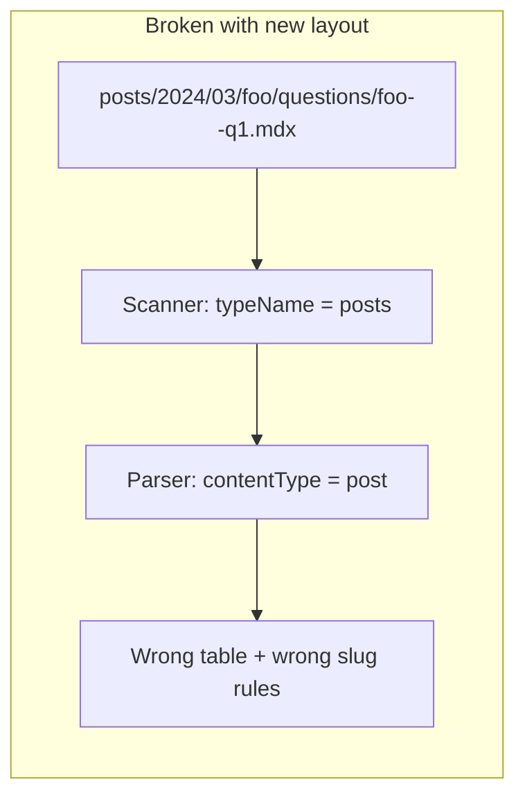

# Adjust mdx-ingest for nested questions

## Confirmed content layout

```text
publish/{posts|booknotes|snippets}/{year}/{month}/{slug}/{slug}.mdx
publish/{posts|booknotes|snippets}/{year}/{month}/{slug}/questions/{post-slug}--{uid}.mdx
```

- Parent MDX slug still comes from the filename (`{slug}.mdx`).
- Question filenames keep `{post-slug}--{uid}.mdx`; `post_slug` stays filename-derived.
- Top-level `publish/questions/` is **removed** (no legacy support).

## Current problem

Today the pipeline assumes a flat top-level `questions/` folder:



[`markdownFileScanner.ts`](tools/mdx-ingest/src/helpers/markdownFileScanner.ts) recursively walks `posts/`, `booknotes/`, and `snippets/`, so nested question files are **found** but **misclassified** as parent content in [`markdownParser.ts`](tools/mdx-ingest/src/helpers/markdownParser.ts).

## Implementation plan

### 1. Split content vs question collection in the scanner

**File:** [`tools/mdx-ingest/src/helpers/markdownFileScanner.ts`](tools/mdx-ingest/src/helpers/markdownFileScanner.ts)

- Remove `questions` from the default `typePattern` regex:
    - from: `/^(projects|coursework|posts|booknotes|snippets|questions)$/`
    - to: `/^(projects|coursework|posts|booknotes|snippets)$/`
- Update `collectMarkdownFiles` to **skip descending into directories named `questions`** (so parent MDX is ingested, question MDX is not).
- Add `collectNestedQuestionFiles(typeDir)` that walks `posts/`, `booknotes/`, and `snippets/` and collects `.mdx`/`.md` files only inside `questions/` subdirectories.
- After scanning parent-type folders, emit one synthetic directory for all nested questions:

```typescript
{
  typeName: 'questions',
  path: baseDir, // publish root
  files: [
    'posts/2024/03/my-post/questions/my-post--abc.mdx',
    'booknotes/2025/01/some-book/questions/some-book--q1.mdx',
    // ...
  ],
}
```

This keeps [`markdownParser.ts`](tools/mdx-ingest/src/helpers/markdownParser.ts) mapping (`questions` → `question`) mostly unchanged.

### 2. Add path-based parent-slug validation in parser/normaliser

**Files:** [`tools/mdx-ingest/src/helpers/markdownParser.ts`](tools/mdx-ingest/src/helpers/markdownParser.ts), [`tools/mdx-ingest/src/helpers/normalise.ts`](tools/mdx-ingest/src/helpers/normalise.ts)

- Extend `ParsedFile` with optional `parentPostSlug?: string` for question files.
- In the parser, when `contentType === 'question'`, derive parent slug from the path segment immediately above `/questions/`:

```typescript
// posts/2024/03/my-post/questions/my-post--abc.mdx → 'my-post'
const parentPostSlug = path.basename(path.dirname(path.dirname(relativeFile)));
```

- In `normaliseQuestion`, keep existing filename-based `post_slug` (`parts.slice(0, -1).join('--')`), but **warn and skip** when it disagrees with `parentPostSlug`. This catches misplaced files without changing the DB contract.

No changes needed in [`validateParsedFiles.ts`](tools/mdx-ingest/src/helpers/validateParsedFiles.ts) or [`upsertRecords.ts`](tools/mdx-ingest/src/helpers/upsertRecords.ts) — they already operate on normalised rows and FK `post_slug`.

### 3. Add focused scanner/parser tests

**New file:** `tools/mdx-ingest/src/helpers/markdownFileScanner.test.ts` (and optionally a small parser/normalise test)

Use a temporary fixture tree mirroring the new layout:

- Assert parent content files are collected, question files are not mixed into `posts` results.
- Assert nested questions are emitted under synthetic `typeName: 'questions'` with publish-relative paths.
- Assert path/filename `post_slug` mismatch is skipped.

Wire a `test` script in [`tools/mdx-ingest/package.json`](tools/mdx-ingest/package.json) (vitest, consistent with other packages).

### 4. Update ingest docs

**Files:** [`tools/mdx-ingest/readme.md`](tools/mdx-ingest/readme.md), [`tools/AGENTS.md`](tools/AGENTS.md)

Replace references to top-level `publish/questions/*.mdx` with the nested path convention and note that `post_slug` is still derived from the filename.

## Related follow-up (outside mdx-ingest, but required for images)

[`tools/quiz-export/src/compile.ts`](tools/quiz-export/src/compile.ts) hardcodes the old path:

```21:21:tools/quiz-export/src/compile.ts
const mdxPath = path.join(opts.contentDir, 'questions', `${question.slug}.mdx`);
```

After ingest works, quiz export will fail to copy question images unless this is updated to locate `**/questions/${question.slug}.mdx` under `CONTENT_DIR` (question slugs are globally unique, so a glob/recursive lookup is sufficient). Recommend doing this in the same PR or immediately after.

## Verification

1. Run content-sync (if needed) so `content/live/` reflects the new repo layout.
2. `pnpm --filter @prj--personal-portfolio--v3/tools--mdx-ingest start:dry-run`
    - Expect questions counted from nested paths, zero from top-level `questions/`.
    - Expect no question files ingested as `posts`.
3. Full ingest + `pnpm --filter @prj--personal-portfolio--v3/tools--quiz-export start:dry-run` to confirm parent FK resolution and export counts.
4. `pnpm typecheck` and new mdx-ingest tests.

## Files to touch

| File                                                                                                         | Change                                                     |
| ------------------------------------------------------------------------------------------------------------ | ---------------------------------------------------------- |
| [`tools/mdx-ingest/src/helpers/markdownFileScanner.ts`](tools/mdx-ingest/src/helpers/markdownFileScanner.ts) | Skip `questions/` in parent walk; collect nested questions |
| [`tools/mdx-ingest/src/helpers/markdownParser.ts`](tools/mdx-ingest/src/helpers/markdownParser.ts)           | Set `parentPostSlug` on question `ParsedFile`              |
| [`tools/mdx-ingest/src/helpers/normalise.ts`](tools/mdx-ingest/src/helpers/normalise.ts)                     | Validate path vs filename `post_slug`                      |
| `tools/mdx-ingest/src/helpers/markdownFileScanner.test.ts`                                                   | New fixture-based tests                                    |
| [`tools/mdx-ingest/package.json`](tools/mdx-ingest/package.json)                                             | Add `test` script                                          |
| [`tools/mdx-ingest/readme.md`](tools/mdx-ingest/readme.md), [`tools/AGENTS.md`](tools/AGENTS.md)             | Doc updates                                                |
| [`tools/quiz-export/src/compile.ts`](tools/quiz-export/src/compile.ts)                                       | Resolve nested question MDX path for asset copy            |
