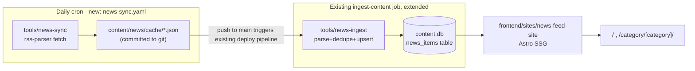

# News Feed Migration to Astro (`news-feed-site`)

## Brutally honest audit of the legacy project (`frontend/legacy/prj--news-wave/`)

This is currently an **untracked, standalone Node.js script**, not part of the v3 monorepo build. It is NOT hosted at `news-feed.paulserban.eu` today — it deploys independently to GitHub Pages (`paulalexserban.github.io/prj--news-wave/`) via its own nested `.github/workflows/main.yml`, which the v3 monorepo's workflows never reference.

Concrete problems worth fixing during the rewrite, not just preserving:

- **No templating engine at all** — HTML is built from hand-rolled JS template-literal functions (`src/html-generator/templates/*.js`). Titles/links are interpolated with no escaping (`_list-item.js`) — real XSS risk since RSS content is untrusted input.
- **Wrong retention window**: `TWO_WEEKS_IN_MS = 365 * 24 * 60 * 60 * 1000` (`src/utils/index.js`) is actually one year, not two weeks, despite the function being called `keepOnlyLastWeekItems`.
- **No cross-source deduplication** — the same story from two outlets (or the same feed URL configured twice, e.g. `github.blog/feed/` and `systemdesignpodcast.com/feed` each appear twice across category files) shows up as separate entries.
- **Stale data never garbage collected** — `phase-fetch.js` spreads old cached feed data forward forever; removing a source from `rss-feeds/*.json` doesn't remove its old cached items.
- **Non-deterministic category order** (`readdir` order), a hardcoded/broken `aria-controls="collapseTwo"` in the accordion markup, dead code (`_panel.js`, unused imports), a persistent `cybersecruity` typo across files/scripts, weekday-only cron (`0 5 * * 1-5`, not daily), zero tests, and a single ~833KB monolithic HTML page with no pagination/search — just nested Bootstrap tabs → accordions → link lists.
- Storage is flat JSON committed to git (`cache/*.json`, ~1.2MB) with no DB — fine for its scale, but the "content stored as text, body wiped to `""` on fetch" pattern throws away anything usable for a snippet/preview.

None of this is hard to fix — it's a good candidate for a clean rebuild, not a lift-and-shift.

## Target architecture

This mirrors the existing `content-sync` (fetch/clone) → `mdx-ingest`/`json-ingest` (parse+upsert) → `content.db` → Astro-at-build-time pattern already used by portfolio/blog, instead of inventing a new pipeline shape.

## 1. Schema — `shared/db-schema/index.ts`

Add a `news_items` table:

- `id` (ULID pk), `slug` (unique, deterministic hash of `guid`/`link` — required because `upsertWithLockCheck` conflicts on `slug`)
- `guid`, `title`, `link`, `source` (feed display name), `source_url` (feed URL), `category`
- `summary` (sanitized short excerpt — improvement over legacy, which wipes content entirely)
- `published_at` / `fetched_at` (timestamps)
- `sync_source` default `'rss'`, `locked` default `false` (so a future CMS could still pin/hide an item)

Run `pnpm db:generate` after the schema edit, commit the new migration SQL under `database/migrations/`.

## 2. `tools/news-sync` (new package) — the "fetch" phase

Analogous to `tools/content-sync`. Runs **only** from the new daily cron workflow, not on every push.

- Port `src/rss-feeds/*.json` from the legacy project into `tools/news-sync/src/feeds/*.json`, fixing the `cybersecruity` → `cybersecurity` typo and removing the duplicate feed URLs (`github.blog/feed/`, `systemdesignpodcast.com/feed`).
- Task graph (via `shared--task-manager`, same pattern as `content-sync`/`json-ingest`): Scan feed config → Fetch feeds in parallel (`rss-parser`) → Normalize (derive slug/guid, sanitize title+summary via `@prj--personal-portfolio--v3/shared--quiz-markdown`'s `sanitizeHtml`, cap length) → Dedupe by `guid` then by normalized `link` across all categories → apply a real, configurable retention window (env `NEWS_RETENTION_DAYS`, default 14 — fixing the 365-day bug) → write `content/news/cache/<category>.json`.
- Output directory `content/news/cache/` is **committed to git** (unlike `content/live/`, which is gitignored) since it's the durable artifact between the daily fetch and the next build.
- `package.json` deps: `rss-parser`, `@prj--personal-portfolio--v3/shared--task-manager`, `@prj--personal-portfolio--v3/shared--quiz-markdown`, `dotenv`.

## 3. `tools/news-ingest` (new package) — the "ingest" phase

Analogous to `tools/json-ingest`. Runs as part of the **existing** `pnpm start` (root `pnpm -r start`), so it executes automatically in `ingest-content` in `deploy-dev.yaml`/`_build-site.yaml` on every normal build — no workflow changes needed there beyond adding the new build/merge job for the site itself.

- Task graph: Scan `content/news/cache/*.json` → Parse → Validate (required: `title`, `link`, `category`) → Normalize to `news_items` rows → Open DB/Run Migrations → Upsert via `upsertWithLockCheck(db, news_items, row, { syncSource: 'rss' })`.
- Prune step: delete `news_items` rows past the retention window and not present in the latest cache (fixes "stale sources persist forever").

## 4. `frontend/sites/news-feed-site` (new Astro app)

Copy the `blog-site` pattern exactly (`astro.config.mjs`, `src/lib/db.ts`, `components.json`, Tailwind v4 + shared--ui/shared--navigation imports):

- `astro.config.mjs`: `site: process.env.ASTRO_SITE ?? 'https://news-feed.paulserban.eu'`, same `react`/`tailwindcss`/`sitemap` integrations, same `ssr.noExternal` for `shared--ui`/`shared--navigation`.
- `src/lib/queries/news.ts`: `getCategories(db)`, `getItemsByCategory(db, category, { limit, offset })`, `getAllItems(db, { limit, offset })`, `getStaticCategoryPaths(db)`.
- Pages (`trailingSlash: 'always'`, matching the others):
    - `src/pages/index.astro` — latest items across categories, using shared--ui `PaginationBar`.
    - `src/pages/category/[category].astro` — per-category listing, `getStaticPaths()` from `getCategories()`.
    - `src/pages/404.astro` — copy pattern from blog-site.
- Components: `NewsCard.astro` (modeled on blog's `PostCard.astro`) rendering source, category `Badge`, relative/absolute date, external-link icon, and a `Stamp` component (already in `shared--ui`) reused for "New today" instead of the legacy's plain-text `[ TODAY ]` marker.
- `SiteHeader.astro`/`SiteFooter.astro`: copy blog's masthead pattern, swap nav links for categories, subtitle e.g. "Engineering Wire", `SiteSwitcher activeSite="news"`.

## 5. `shared/navigation` — add the 4th site

- `src/types.ts`: `SiteId = 'portfolio' | 'blog' | 'quiz' | 'news'`.
- `src/urls.ts`: `AppSegment` add `'news'`; `SiteUrlsConfig.production`/`CrossAppUrls` add `news: string`; `buildSiteTabs` add `{ id: 'news', label: 'News', href: urls.news }`.
- Update `frontend/sites/portfolio-site/src/lib/urls.ts`, `frontend/sites/blog-site/src/lib/urls.ts`, `frontend/apps/quiz-web-app/src/lib/urls.ts` to pass `news: 'https://news-feed.paulserban.eu'` into their `createSiteUrls({ production: {...} })` calls, so `SiteSwitcher`/`buildSiteTabs` on all 4 apps show a consistent 4-way switcher.

## 6. CI/CD

- New `.github/workflows/news-sync.yaml`: `schedule` (daily cron, e.g. `0 6 * * *`) + `workflow_dispatch`; checkout, `./.github/actions/setup-monorepo`, run `pnpm --filter @prj--personal-portfolio--v3/tools--news-sync start`, then commit+push `content/news/cache/` only if changed (matching the legacy project's `[skip ci]`-style guard so an empty diff doesn't trigger a no-op deploy). The push to `main` naturally re-triggers `deploy-dev.yaml`, rebuilding everything.
- `.github/workflows/deploy-dev.yaml` and `.github/workflows/_build-site.yaml`: add a `build-news` job (mirrors `build-blog`), a `news_base`/`/news` path segment, extend the `merge` job's `_site/` scaffold and the inline 404-router script to cover `/news`.

## Explicitly out of scope for v1 (call out to user, don't build)

- Client-side search/filter across headlines, per-source pages, an outbound RSS/Atom feed of the digest, saved/favorited articles, and personalization — none of these exist in the legacy project either; flag as candidate follow-ups once v1 ships.
- Actual subdomain DNS/CloudFront provisioning for `news-feed.paulserban.eu` — deferred to whatever future infra task wires up real hosting for `paulserban.eu`/`blog.paulserban.eu`/`quiz.paulserban.eu` (currently all still placeholders per the semantic-release/CI-CD plan).
- Curating/trimming the ~85 RSS feeds' topical overlap (e.g. `web-dev`/`front-end`/`javascript` categories overlap heavily) — carried over as-is (deduped, typo-fixed) since that's an editorial decision, not an engineering one.
  </plan>
  <todos>[{"id": "schema", "content": "Add news_items table to shared/db-schema/index.ts, run pnpm db:generate, commit migration"}, {"id": "news-sync", "content": "Create tools/news-sync: port+dedupe+typo-fix rss-feeds config, fetch task graph, write content/news/cache/*.json"}, {"id": "news-ingest", "content": "Create tools/news-ingest: scan/parse/validate/normalize/upsert cache into news_items, with prune step"}, {"id": "news-feed-site", "content": "Scaffold frontend/sites/news-feed-site (Astro, copy blog-site pattern): astro.config, db/query lib, index + category pages, NewsCard/SiteHeader/SiteFooter"}, {"id": "shared-navigation", "content": "Add 'news' SiteId/AppSegment to shared/navigation and wire production URL into portfolio/blog/quiz urls.ts so all 4 apps show a 4-way SiteSwitcher"}, {"id": "ci-news-sync", "content": "Add .github/workflows/news-sync.yaml daily cron + workflow_dispatch that fetches and commits content/news/cache/"}, {"id": "ci-build-wiring", "content": "Add build-news job + /news path to deploy-dev.yaml and _build-site.yaml (build, merge, 404 router)"}]
