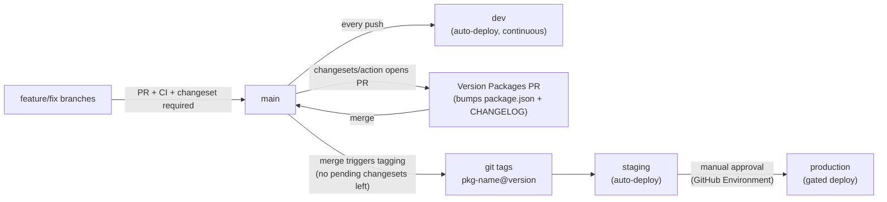
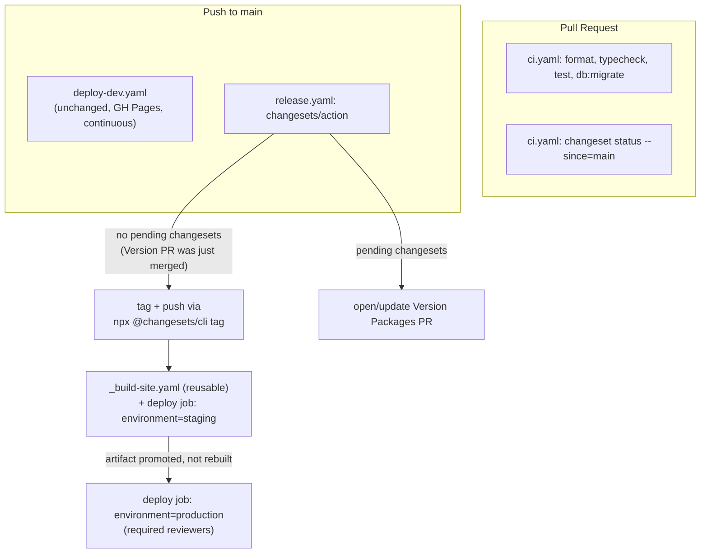

# Semantic versioning + CI/CD pipelines (dev/stage/prod)

Explicitly out of scope: [.cursor/plans/aws_s3_cloudfront_hosting_+_v2_redirect_a60ac94e.plan.md](.cursor/plans/aws_s3_cloudfront_hosting_+_v2_redirect_a60ac94e.plan.md) is outdated and will not be implemented. No hosting provider is chosen yet for staging/production — those pipelines build and package the site but stub out the actual "upload to host" step.

Decisions confirmed with user:
- **Versioning**: Changesets (already scaffolded at `.changeset/config.json`), all packages stay `private: true` — no npm/registry publishing, tags/changelogs are purely internal.
- **Branching**: Trunk-based. Single long-lived `main`; every PR merges there; `main` continuously auto-deploys to **dev**; a version bump (via the Changesets "Version Packages" PR) is what promotes a build through **staging** then **production** (manual approval gate).

## Branching & release flow



- No `develop`/`release/*`/`hotfix/*` branches. Hotfixes are just normal short-lived branches (`fix/...`) PR'd into `main`, going through the same dev→stage→prod promotion.
- Feature branch naming stays aligned with the existing commitlint conventional-commit types (`feat/...`, `fix/...`, `chore/...`, etc.) — informational convention, not enforced by tooling.
- All versioned packages (apps, `shared/*`, `tools/*`) bump independently; `updateInternalDependencies: patch` (already set) cascades bumps to dependents automatically.

## Versioning with Changesets (internal-only, no publish)

- [.changeset/config.json](.changeset/config.json): add `"privatePackages": { "version": true, "tag": true }` so `changeset version`/`changeset tag` work for `private: true` packages. Keep `baseBranch: main`.
- Add missing [.changeset/README.md](.changeset/README.md) (standard Changesets template).
- Root [package.json](package.json): add convenience scripts:
  - `"release:add": "changeset"`
  - `"release:status": "changeset status --since=main"`
  - `"release:version": "changeset version"`
  - `"release:tag": "changeset tag"`
- Contributors run `pnpm release:add` in PRs that change a versioned package; CI enforces this is present (see CI workflow below). No `changeset publish`/npm registry involved anywhere — tagging only, via `npx @changesets/cli tag`.

## CI/CD pipeline (GitHub Actions)



### 1. `.github/workflows/ci.yaml` (new — revives + extends [.github/workflow-bkp/ci.yaml](.github/workflow-bkp/ci.yaml))
- Triggers: `pull_request` targeting `main`, and `push` to `main`.
- Job `quality`: checkout, `./.github/actions/setup-monorepo`, `pnpm formats:check`, `pnpm typecheck`, `pnpm test`, `pnpm db:migrate` (same steps as the backed-up file).
- Job `changeset-check` (PRs only): `fetch-depth: 0` checkout, run `pnpm release:status`; skip (via an `if:`) when the PR head ref is the Changesets bot branch (`changeset-release/main`) or actor is `github-actions[bot]`.
- Delete [.github/workflow-bkp/ci.yaml](.github/workflow-bkp/ci.yaml) (folded into the real workflow).

### 2. `.github/workflows/release.yaml` (new)
- Trigger: `push` to `main`.
- Job `version`: `contents: write`, `pull-requests: write` permissions; `changesets/action@v1` with `publish: npx @changesets/cli tag`, `commit: "chore: version packages"`, `title: "chore: version packages"`. Outputs `published` / `publishedPackages`.
  - When changesets are pending: action opens/updates the "Version Packages" PR only (nothing deploys).
  - When that PR is merged (no changesets left, this push *is* the version bump): action runs the tag command and pushes tags — this is the actual "release".
- Job `deploy-stage` (`needs: version`, `if: needs.version.outputs.published == 'true'`): calls the new reusable `_build-site.yaml` workflow, then deploys to `staging` environment with a placeholder step; uploads the built `_site/` as a long-retention artifact.
- Job `deploy-prod` (`needs: deploy-stage`): `environment: production` (manual approval — configured as a GitHub Environment protection rule, see checklist below); downloads the **same artifact** built for staging (no rebuild) and runs the same placeholder deploy step against `production`. This is the "promote, don't rebuild" GitOps rule.

### 3. `.github/workflows/_build-site.yaml` (new, reusable `workflow_call`)
- Inputs: `environment` (string). Mirrors the existing ingest/build/merge steps from [.github/workflows/deploy-dev.yaml](.github/workflows/deploy-dev.yaml) (jobs `ingest-content`, `build-portfolio`, `build-blog`, `build-quiz`, `merge`) but generic: no `actions/configure-pages`/GH-Pages coupling — `ASTRO_SITE`/`ASTRO_BASE`/`VITE_APP_BASE` come from workflow inputs/vars (defaults to root `/`), since the real values depend on the still-undecided hosting provider/domain.
- Output: uploads `_site/` as a `site-bundle` artifact (used by the caller's deploy job).
- Deploy step (in `release.yaml`'s `deploy-stage`/`deploy-prod` jobs, not in this reusable file) is intentionally a stub:

```yaml
- name: Deploy (placeholder - hosting provider TBD)
  run: |
      echo "No hosting provider selected yet."
      echo "Built site bundle is attached as a workflow artifact for this run: site-bundle"
      echo "Replace this step with the real deploy command once a provider (S3/CloudFront, Netlify, Vercel, Cloudflare Pages, etc.) is chosen."
```

### 4. `.github/workflows/deploy-dev.yaml` — unchanged
- Keeps deploying every push to `main` straight to GitHub Pages (dev), decoupled from the release/versioning cycle, matching "main is always deployable, dev = continuous deployment."

## GitOps practices applied

- Git is the only trigger for deployments — no manual/click-ops deploys; environment promotion state is fully derived from `main` + tags.
- GitHub Environments (`dev`/`github-pages`, `staging`, `production`) hold environment-scoped secrets/vars and protection rules — ready to receive real hosting credentials later without workflow changes.
- Same build artifact is promoted from staging to production rather than rebuilt, guaranteeing what's tested in staging is exactly what ships to production.
- All release state (versions, changelogs, tags) is committed to git via the Version Packages PR — fully auditable, no external release tooling required.

## Documentation

- New ADR [_docs/architectural-knowledge-management/architectural-decision-log/adr-010--release-and-branching-strategy.md](_docs/architectural-knowledge-management/architectural-decision-log/adr-010--release-and-branching-strategy.md): records the trunk-based branching model, Changesets internal-only versioning, and dev/stage/prod promotion flow; notes hosting provider is still TBD and the AWS plan is not being implemented.
- Update [_docs/AGENTS.md](_docs/AGENTS.md): add `adr-010` to the accepted-ADR table and update the implementation-status row for CI/CD to reflect staging/production pipelines existing (with hosting stubbed).

## Manual GitHub setup required after merge (cannot be done via code)

1. Branch protection on `main`: require PR review + required status checks `quality` and `changeset-check` from `ci.yaml`.
2. Create GitHub Environments: `staging` (no reviewers needed, or optional) and `production` (require reviewers — this is what implements the manual approval gate between stage and prod).
3. Confirm the existing `github-pages` environment stays as-is for dev.

## Todos
</plan>
<parameter name="todos">[{"id": "changesets-config", "content": "Update .changeset/config.json (privatePackages) and add .changeset/README.md"}, {"id": "root-scripts", "content": "Add release:add/status/version/tag scripts to root package.json"}, {"id": "ci-workflow", "content": "Add .github/workflows/ci.yaml (quality + changeset-check), remove workflow-bkp/ci.yaml"}, {"id": "reusable-build", "content": "Add .github/workflows/_build-site.yaml reusable build/package workflow"}, {"id": "release-workflow", "content": "Add .github/workflows/release.yaml (changesets/action + staged/prod promotion with placeholder deploy)"}, {"id": "adr-doc", "content": "Write adr-010 release-and-branching-strategy.md and update _docs/AGENTS.md"}]