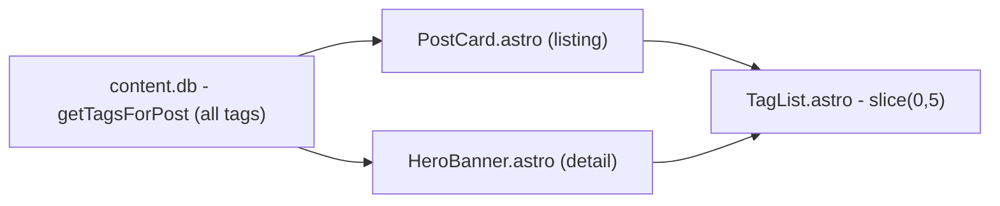

## Root cause

Both the post-listing cards and the post detail hero banner render tags through the same shared component, [frontend/sites/blog-site/src/core/library/components/TagList.astro](frontend/sites/blog-site/src/core/library/components/TagList.astro), which unconditionally does:

```5:11:frontend/sites/blog-site/src/core/library/components/TagList.astro
const { tags } = Astro.props;
const slicedTags = tags.slice(0, 5);
```

Flow:



The DB query already returns all tags for a post; the truncation only happens at render time in `TagList.astro`, and it applies everywhere it's used, including the detail page's `HeroBanner`.

## Change

1. **`TagList.astro`** — add an optional `limit?: number` prop. When provided, slice to that count; when omitted, render all tags.

```astro
interface Props {
    tags: TagRow[];
    limit?: number;
}

const { tags, limit } = Astro.props;
const slicedTags = limit != null ? tags.slice(0, limit) : tags;
```

2. **[frontend/sites/blog-site/src/core/library/modules/PostCard/PostCard.astro](frontend/sites/blog-site/src/core/library/modules/PostCard/PostCard.astro)** (listing card, used by hub `/` and `/tags/[tag]`) — pass `limit={5}` explicitly to `<TagList tags={tags} limit={5} />` to preserve current listing behavior.

3. **[frontend/sites/blog-site/src/core/library/modules/HeroBanner.astro](frontend/sites/blog-site/src/core/library/modules/HeroBanner.astro)** (used by the detail page via `PostTemplate.astro`) — no change to the prop passing (`<TagList tags={tags} />`), which will now naturally render all tags since no `limit` is passed.

4. **[frontend/sites/blog-site/src/core/library/modules/PostCard/PostCardReact.tsx](frontend/sites/blog-site/src/core/library/modules/PostCard/PostCardReact.tsx)** — this is the React mirror used only by the interactive listing island (`/post`, `/snippet`, `/booknote` index pages), so it stays capped at 5. No change needed (its `post.tags.slice(0, 5)` already matches the desired listing behavior) — leaving as-is keeps listing/hub cards visually consistent.

## Files touched

- `frontend/sites/blog-site/src/core/library/components/TagList.astro` (add `limit` prop)
- `frontend/sites/blog-site/src/core/library/modules/PostCard/PostCard.astro` (pass `limit={5}`)

No changes needed to `HeroBanner.astro`, `PostTemplate.astro`, `PostCardReact.tsx`, or DB queries — they already fetch/pass the full tag set.

Note: `frontend/sites/portfolio-site` has a separate, unrelated duplicate `TagList.astro` for case studies — out of scope since the request is about the "log" (blog) site.
