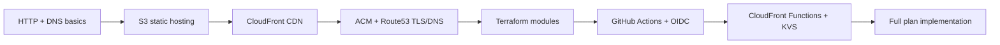

Here is a structured learning map for implementing the plan yourself, ordered roughly from foundations to the most plan-specific pieces.

---

## What you are building (one sentence)

Three Terraform-managed static sites on S3 + CloudFront (portfolio, blog, quiz), a CloudFront Function + KeyValueStore redirect on the blog for legacy v2 posts, GitHub Actions prod deploy via OIDC, and a DNS cutover from v2 to v3 on `paulserban.eu`.

---

## 1. Core web hosting concepts

| Topic | Why it matters for this plan |
|---|---|
| **Static site hosting** | Astro/Vite build to `dist/`; no server at runtime |
| **CDN edge caching** | CloudFront serves cached copies close to users |
| **Origin vs edge** | S3 is origin; CloudFront is edge; redirect runs before origin |
| **Subdomain vs sub-path routing** | DEV uses `/home/`, `/blog/`, `/quiz/`; prod uses separate subdomains |
| **SPA vs SSG routing** | Blog/portfolio are pre-built HTML; quiz needs 404 → `index.html` fallback |
| **HTTP redirects (301 vs 302)** | Plan uses 302 for legacy blog posts not in v3 |
| **Cache-Control semantics** | `max-age`, `immutable`, `must-revalidate` — set at S3 upload time |
| **Content hashing / cache busting** | Hashed assets (`app.abc123.js`) can be cached forever |

**Skills:** reason about request flow (browser → DNS → CloudFront → S3), choose cache TTLs, debug “stale content after deploy.”

---

## 2. AWS services (the main stack)

### S3
- Private buckets (block public access)
- **Origin Access Control (OAC)** — CloudFront reads S3; bucket stays private
- `aws s3 sync` with `--delete`, `--cache-control`, `--exclude`/`--include`
- Bucket policies and IAM least privilege

### CloudFront
- Distributions, origins, default root object (`index.html`)
- **Cache behaviors** — path patterns (`/assets/*` vs `/*.html`)
- **Cache policies** vs legacy forwarded headers
- **Invalidation** — when and why (`/*.html` after deploy, not hashed assets)
- **Custom error responses** — quiz SPA: 403/404 → `/index.html` (200)
- **Alternate domain names (CNAMEs)** — attach custom domains to a distribution
- **CloudFront’s fixed hosted zone ID** (`Z2FDTNDATAQYW2`) for Route53 alias records

### ACM (AWS Certificate Manager)
- TLS certs for HTTPS
- **Must be in `us-east-1`** for CloudFront (even if S3 is elsewhere)
- DNS validation via Route53
- SAN certs (e.g. add `v2.paulserban.eu` to existing cert)

### Route53
- Hosted zones, A/AAAA records
- **Alias records** to CloudFront (not plain CNAME at apex)
- Shared zone implications when repointing apex from v2 → v3

### CloudFront Functions + KeyValueStore
- `viewer-request` event (runs before cache/origin lookup)
- `cloudfront-js-2.0` runtime
- KVS: key lookup, `put-key` / `update-keys` from CI
- Limits: ~1 ms, 2 MB memory — why this beats Lambda@Edge here

### IAM + OIDC
- IAM roles, policies, trust relationships
- **GitHub Actions OIDC** — `id-token: write`, `aws-actions/configure-aws-credentials`
- Deploy role scoped to specific buckets/distributions/KVS
- No long-lived access keys in GitHub Secrets

### Optional but useful
- **SSM Parameter Store** — store Terraform outputs for CI
- **DynamoDB** — Terraform state locking
- **CloudWatch** — basic logs/metrics for debugging

**Skills:** read AWS console + CLI output, write least-privilege IAM, understand regional constraints (ACM for CloudFront).

---

## 3. Infrastructure as Code — Terraform

| Concept | Plan usage |
|---|---|
| **Providers** (`aws`, provider aliases) | `us-east-1` alias for ACM/CloudFront resources |
| **Modules** | Reusable `static-site`, `blog-redirect-function` |
| **Variables / outputs** | Domain names, bucket names, distribution IDs for CI |
| **Remote state** | S3 backend + DynamoDB lock table (bootstrap) |
| **Data sources** | `aws_route53_zone` for existing `paulserban.eu` zone |
| **Resource dependencies** | Cert validation → distribution → DNS alias |
| **Workspace / env layout** | `infrastructure/aws/envs/prod/` |
| **State separation** | Bootstrap applied once manually; prod env separate |
| **Import vs greenfield** | v2 infra stays external; you only add DNS alias + redirect target |

**Skills:** `terraform plan/apply`, module I/O design, avoiding state drift, reading HCL for CloudFront + S3 + Route53.

---

## 4. CI/CD — GitHub Actions

| Topic | Plan usage |
|---|---|
| **Workflow triggers** | Content deploy on push; infra deploy manual/path-filtered |
| **Reusable actions** | Your existing `setup-monorepo` |
| **Job dependencies / artifacts** | Ingest → build → deploy pipeline (like `deploy-dev.yaml`) |
| **Environment variables at build** | `ASTRO_SITE`, `ASTRO_BASE=/`, `VITE_APP_BASE=/` |
| **OIDC to AWS** | Assume deploy role without static keys |
| **Deploy scripts** | S3 sync with cache-control split, CloudFront invalidation, KVS sync |
| **Concurrency groups** | Avoid overlapping prod deploys |
| **Secrets vs OIDC** | `CONTENT_REPO_TOKEN` stays; AWS uses OIDC |

**Skills:** write a multi-job workflow, debug failed deploy steps, separate “app deploy” from “infra deploy.”

---

## 5. Your monorepo specifics

| Area | What to understand |
|---|---|
| **Astro SSG** | `getStaticPaths()`, `trailingSlash: 'always'`, build output layout |
| **Blog gating logic** | Posts only built if they have quiz questions (`publishedQuestionPostSlugs`) |
| **URL conventions** | v3: `/post/{slug}/`; v2: `/blog/post/{slug}` |
| **`getAllSlugs()`** | Same query drives static paths and KVS population |
| **Quiz SPA (Vite)** | Client-side routing, `base` path, `public/data/` JSON |
| **Content pipeline** | `pnpm start` → `content.db` → build |
| **pnpm workspaces** | Filter builds: `pnpm --filter ... build` |

**Skills:** trace “which slugs exist at build time” from DB query → Astro routes → KVS keys.

---

## 6. DNS, TLS, and cutover strategy

- How apex (`paulserban.eu`) and `www` currently point to v2
- Safe cutover: cert ready → distribution ready → flip Route53 → verify
- Adding `v2.paulserban.eu` to **existing** v2 CloudFront (manual runbook)
- Propagation, TTL, and rollback thinking
- Verifying v2 URL patterns before hardcoding redirect targets

**Skills:** plan a low-risk DNS migration, document manual steps you cannot Terraform.

---

## 7. Caching and performance

From your existing caching spike:

- Long TTL + `immutable` for hashed assets
- Short TTL / `must-revalidate` for HTML
- When invalidation is still needed
- Why you don’t invalidate `/assets/*` after every deploy
- CloudFront Function redirect responses: `cache-control: no-cache`

**Skills:** design a deploy that minimizes invalidation cost and maximizes cache hit rate.

---

## 8. Security

- Private S3 + OAC (no public bucket)
- IAM role per concern (deploy vs Terraform admin)
- OIDC trust policy scoped to your repo/branch
- No secrets in Terraform state (use SSM or GitHub Secrets appropriately)
- TLS everywhere (ACM)

---

## 9. Documentation and decision-making

- Writing an **ADR** (superseding Cloudflare drafts)
- Runbooks for external infra (v2 CloudFront CNAME + cert)
- Architecture doc updates
- Cost reasoning (CloudFront Functions vs Lambda@Edge)

---

## Suggested learning order

---

## Mini project ideas (progressive)

### Level 1 — Foundations

1. **“Hello static site”**  
   Build a 3-page HTML site locally. Upload to a **public** S3 bucket with static website hosting. Access via S3 website endpoint.  
   *Learn:* S3, static hosting, `aws s3 sync`.

2. **“One distribution”**  
   Same site, but: private S3 + CloudFront + OAC + custom cache behavior for `/assets/*`.  
   *Learn:* OAC, origin config, basic caching.

3. **“Custom domain lab”**  
   Buy/use a cheap domain or a subdomain you own. ACM cert (DNS validation) + Route53 alias → CloudFront.  
   *Learn:* ACM `us-east-1`, alias records, HTTPS.

---

### Level 2 — Terraform

4. **“Terraform static-site module (v0)”**  
   One module: S3 + OAC + CloudFront + Route53 record. Parameterize `domain_name` and `bucket_name`.  
   *Learn:* modules, variables, outputs, remote state (even local state first).

5. **“Terraform bootstrap”**  
   Separate bootstrap stack: S3 state bucket + DynamoDB lock. Point prod env at it.  
   *Learn:* remote state, locking, bootstrap chicken-and-egg.

6. **“Three sites, one module”**  
   Instantiate your module 3× with different names (`portfolio`, `blog`, `quiz` subdomains on a test domain).  
   *Learn:* module reuse, env-specific `tfvars`.

---

### Level 3 — CI/CD

7. **“OIDC deploy pipeline”**  
   GitHub Action: on push, build a tiny static site, `aws s3 sync`, `create-invalidation`. Auth via OIDC only.  
   *Learn:* IAM trust policy, `configure-aws-credentials`, least-privilege deploy role.

8. **“Cache-control deploy script”**  
   Shell script that syncs with two passes: assets get `immutable` 1yr, HTML gets `max-age=0, must-revalidate`.  
   *Learn:* exact pattern from your caching spike and prod workflow.

9. **“SPA on CloudFront”**  
   Deploy a minimal React/Vite SPA. Add custom error response 404 → `/index.html`. Test client-side routes.  
   *Learn:* quiz distribution behavior.

---

### Level 4 — Redirect logic

10. **“CloudFront Function playground”**  
    Function that logs/rewrites paths (e.g. add a header, block `/admin`). Attach to `viewer-request`.  
    *Learn:* function association, event types, deployment speed.

11. **“KVS redirect mini-blog”**  
    Two “sites”: v3 with 5 slugs in KVS, v2 with fake legacy URLs. Function: if slug ∉ KVS → 302 to v2 pattern. Populate KVS via CLI in a deploy script.  
    *Learn:* exact redirect mechanism from the plan.

12. **“Slug export from your repo”**  
    Small Node script that queries `content.db` (or mocks `getAllSlugs()`) and outputs JSON consumed by a deploy step that calls `aws cloudfront-keyvaluestore put-key`.  
    *Learn:* bridge between Astro build logic and AWS.

---

### Level 5 — Integration (dress rehearsals)

13. **“DEV-parity prod dry run”**  
    Clone your `deploy-dev.yaml` flow but target AWS instead of Pages: ingest → build portfolio only → S3 sync. Use a staging subdomain.  
    *Learn:* env vars (`ASTRO_BASE=/`), artifact handoff, end-to-end pipeline.

14. **“Blog + redirect staging”**  
    Deploy blog-site to staging. Wire KVS from real `getAllSlugs()`. Hit a slug that exists (200) and one that doesn’t (302 to a stub v2 URL).  
    *Learn:* full blog path before touching production DNS.

15. **“DNS cutover simulation”**  
    On a test apex domain, point DNS from “old” to “new” distribution. Document rollback steps.  
    *Learn:* cutover runbook for `paulserban.eu`.

---

## Resources worth studying

| Resource | Focus |
|---|---|
| [AWS: Hosting static website on S3 + CloudFront](https://docs.aws.amazon.com/AmazonCloudFront/latest/DeveloperGuide/GettingStarted.SimpleDistribution.html) | OAC, basic distribution |
| [CloudFront Functions](https://docs.aws.amazon.com/AmazonCloudFront/latest/DeveloperGuide/cloudfront-functions.html) | viewer-request, limits |
| [CloudFront KeyValueStore](https://docs.aws.amazon.com/AmazonCloudFront/latest/DeveloperGuide/kvs-with-functions.html) | KVS + functions |
| [Terraform AWS provider docs](https://registry.terraform.io/providers/hashicorp/aws/latest/docs) | `aws_cloudfront_distribution`, `aws_s3_bucket`, etc. |
| [GitHub Actions OIDC with AWS](https://docs.github.com/en/actions/deployment/security-hardening-your-deployments/configuring-openid-connect-in-amazon-web-services) | No long-lived keys |
| Your repo: `_docs/.../01 cloudfront caching.md` | Cache strategy already chosen |
| Your repo: `.github/workflows/deploy-dev.yaml` | Pipeline pattern to mirror |

---

## Checklist before you touch production

- [ ] Can explain browser → Route53 → CloudFront → S3 for one request
- [ ] Can `terraform plan` a module and predict what changes
- [ ] OIDC role can sync S3 and invalidate CloudFront, nothing else
- [ ] Confirmed live v2 URL pattern (`/blog/post/{slug}` etc.)
- [ ] KVS keys match `getAllSlugs()` output format (`post/slug`, not just `slug`)
- [ ] Quiz SPA deep links work after 404 → `index.html` mapping
- [ ] Rollback plan for apex DNS if v3 deploy fails

---

If you want, I can turn this into a week-by-week study plan mapped to the plan’s todos (`tf-bootstrap`, `static-site module`, `deploy-prod.yaml`, etc.), or a “minimum viable path” that gets you to a staging deploy with the fewest AWS resources first.