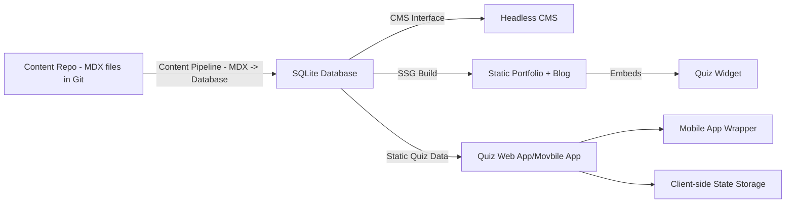

# Product Requirements Document (PRD)

## Software Engineering Portfolio + Software Engineering Blog + Flashcard Quiz Platform

| Field                | Value                                                                        |
| -------------------- | ---------------------------------------------------------------------------- |
| **Product Name**     | Personal Portfolio v3 + Blog + Flashcard Quiz Platform                       |
| **Document Version** | 1.0                                                                          |
| **Author**           | Paul Serban                                                                  |
| **Date**             | 2026-03-25                                                                   |
| **Target Release**   | v0.1 (initial iteration)                                                     |
| **Stakeholders**     | - Paul Serban (Developer, Content Creator), End Readers, App Store Reviewers |

## Executive Overview

This document defines the product requirements for the initial release (v0.1) of a software engineering personal portfolio, blog and flashcard platform. The platform serves thee purposes:

1. **Portfolio** - present the author's professionl identid=ty, skills, and project work to recruiters and collaborators
2. **Blog** - deliver blong-form technical content as a fast, statically generated website
3. **Quiz** - reinforce reader comprehension theough an Anki-style spaced repetition quiz, available as a blog widget, a standalone web app, and a native obile app

All reader/learner state is stored client-side in v0.1 - no user accuounts, no server-side user database. Content is authored in MDX files in a git repository. A content pipeline synchronises those files into a database that powers both the CMS editing experience and the static site build.

For technical implementation decisions - stack decisions, schema definitions, pipeline design, and deployment architecture - refer to the Architecture Document v1.0.

## Problem Statement

### Author Problem

A software engineer maintainig a personal platform lacks a unified, low-friction way to:

- present their professional identitym skills, and project work to potential employers and collaborators in a single cohesive place
- author content in a developer-native format (MDX, Git) while retaining the option to make edits though a visual CMS
- create quiz questions intrinsically linked to the posts that explin the underling concepts
- deliver all of the above across a portfolio site, and a mobile learning app without maintaing separate codebase or content stores

### Reader Problem

Readers of technical blogs consume contint passively. Without active reacall mechanisms tied directly to the content they read, retention is low. There is no lighweight, account-free way to turn a blog post into study session on the go - in a browser or on a phone.

### Gap

No existing solutions bridges Git-native MDX autoring, a CMS editing fallback, a professional portfolio presentation, and a multi-surface spaced repetition quiz from a single content source without requiring separate tools, separate data stoires, or user accounts.

## Goals & Success Metrics

### Goals

| #   | Goal                                                                                                         | Priority     |
| --- | ------------------------------------------------------------------------------------------------------------ | ------------ |
| G1  | Author can present professional identity (about me, skills, projects) on a home and portfolio page           | MUST HAVE    |
| G2  | Author can write blog posts and questions in MDX via Git with no friction                                    | MUST HAVE    |
| G3  | Content is reliably sunchonised into a database and editbale via a visual CMS interface with minimal latency | NICE TO HAVE |
| G4  | Blog is staticall generated, fast and SEO-friendly                                                           | MUST HAVE    |
| G5  | Quiz widget is accessible directly from any blog post                                                        | MUST HAVE    |
| G6  | Quiz web app and mobile share one codebase and one used state model                                          | MUST HAVE    |
| G7  | Spaced repetition behavior mirros the Anki UX and SM-2 algorithm                                             | MUST HAVE    |
| G8  | User quiz progress persists locally with no login required                                                   | MUST HAVE    |
| G9  | Mobile app is distibutable via iOS App Store and Google Play with a native experience                        | SHOULD HAVE  |
| G10 | Author can edit content via CMS without breaking the MDX authoring workflow                                  | NICE TO HAVE |
| G11 | Questions-to-post relationships are enforced and auditable via slug convention                               | MUST HAVE    |

### Success Metrics

| Metric                                                               | Target                            |
| -------------------------------------------------------------------- | --------------------------------- |
| Blog Lighthouse Performance Score                                    | >= 95                             |
| Blog Lighthouse SEO score                                            | >= 95                             |
| First Contentful Paint (FCP)                                         | < 1.2s                            |
| Content pipeline: zero data loss on ingest                           | 100%                              |
| Quiz widget time-to-interactive from post page                       | < 1.5s                            |
| Quiz web app Lighthouse PWA score                                    | >= 90                             |
| SM-2 interval output matches Anki reference cases                    | 100% unit test coverage on engine |
| Mobile app passes App store / Play store review on first submission  | 100%                              |
| User stats survive browser refresh and app restart with no data loss | 100%                              |

## User Personas

### Persona A - The Author (Primary)

> "I want one place that shows who am I professionally, lets me write in my editor and push to Git, and ahve everthing just work - but alos I want a nice UI to fix a typo withough opening teh terminal."

- Software engineer / technical writer maintaining a personal platform
- Comfortable with git, MDX, and terminal tooling
- Wants a professinal portfolio to share with potential employees and collaborators
- Occasionally wants a visual CMS for minor content edits
- Creates quiz questions as a natural extension of writing a post
- Wants content delivered on web and mobile without duplicating effort

### Persona B - The Recruiter / Collaborator (Primary)

> "I heard about this engineer and want to quickly understand what they have built, what they know, and whether they are worth reacinh out to."

- Engineering recruiter, hiring manager, or potential technical collaborator
- Arrives via LinkedIn link, referral, GitHub profile, or search engine
- Wants to see skills, project work, and evidence of technical depth on one place
- May read a blog post to asses communication ability and depth of knowledge
- Low intent to use the quiz system; high interest in portfolio presentation

### Persona C - The Reader / Learner (Primary)

> "I just read a great post on closures. I want to quiz myself on it now, and again next week, without signing up for anything."

- Software engineer, student, or career switcher reading to learn
- Familiar with or interested in spaced repetition tools like Anki
- Does not want to create an account on a personal blog
- Access content on desktop and mobile interchangeably

### Persona D - The Casual Reader (Secondary)

> "I'm just here to read. Maybe I'll try to quiz if I see it."

- General technical reader, often arriving via search
- Low intent to install a mobile app
- Will interact with the quiz widget if it is non-intrusive and immediatly available

## Assumptions & Constraints

### Assumptions

- A1: the author is the sole content creator in v0.1; no multi-author workflows are needed
- A2: post and project slus are immutable once published; changing a slug is a breaking change
- A3: all quiz quesiton content is written by the author
- A4: the headless CMS instance is self-hosted and accessible only to the author
- A5: the quiz mobile app wraps the same web app; no native-only features are required in v0.1

### Technical Constraints

These are product-level constraints the archiecture mush honour. Implementation detailes are speficed in the Architecture Document v1.0.

- TC1: the blog must be fully statically generated - no runtime server, no API routes at runtime
- TC2: no server-side user database in v0.1 - all reader/learner state is stored client-side in browser local storage or mobile device storage
- TC3: the quiz app must function offline (PWA on web, bundled data on mobile)
- TC4: the mobile app must comply with the App Store Review Guidelines and Google PLay polices
- TC5: the quiz widget mist not block blog page render or degrade Lighthouse scores
- TC6: no user PII is collected or stored in v0.1
- TC7: the sahred quiz codebase must not depend on any blog-specific runtime context

## System Overive



- the content pipeline synchronises MDX files into a database
- a lock mechanisms governs which surface - MDX or CMS - owns any given entity at a time, preventing conflicting edits
- at build time the static site and all quiz data files are generated from the database
- all quiz users states lives entierly on the client side - no user accounts, no server-side user database

For full system archiectture, data model, pileine state-machine, and deployment design, see the Architecture Document v1.0.

## Feature Requirements

Requirements use MoSCoW prioritisation:

- M = Must have
- S = Should have
- C = Could have
- W = Won't have in v0.1.

### Content Authoring

### Content Management

### Portfolio & Home Page

### Blog Website

### Flashcard Quiz Widget

### Flashcard Quiz Web App

### Flashcard Quiz Mobile App

### Spaced Repetition Behavior

### User Learning State

## Non-Functional Requirements

### Performance

| ID     | Requirement                                    | Target                                     |
| ------ | ---------------------------------------------- | ------------------------------------------ |
| NFR-P1 | Blog Lighthouse Performance Score              | >= 95 desktop, >= 85 mobile (simulated 4G) |
| NFR-P2 | Blog First Contentful Paint (FCP)              | < 1.2s                                     |
| NFR-P3 | Quiz widget JS bundle size                     | < 80 KB gzipped                            |
| NFR-P4 | Quiz widget time-to-interactive from post page | < 2 on broadband                           |

### Reliablity

| ID     | Requirement                                                                                                    |
| ------ | -------------------------------------------------------------------------------------------------------------- |
| NFR-R1 | Content pipeline MUST be indempotent - same input always produces same database state                          |
| NFR-R2 | Content pipeline MUST use transactions - no partial writes on error                                            |
| NFR-R3 | The quiz widget MUST degrade gracefully if question data fails to load - the blog page must not crash or block |
| NFR-R4 | Client-side state writes MUST be atomic per card update - a patial write must not corrupt the deck             |

### Accessibility

| ID     | Requirement              | Target                                                          |
| ------ | ------------------------ | --------------------------------------------------------------- |
| NFR-A1 | Blog and portoflio pages | WCAG 2.1 AA                                                     |
| NFR-A2 | Quiz modal               | Focus trapped; fully keyboard navigable; screen reader friendly |
| NFR-A3 | Quiz rating buttons      | Labled for screen readers; at least 44x44px for touch targets   |

### Security

| ID     | Requirement                                                                                                              |
| ------ | ------------------------------------------------------------------------------------------------------------------------ |
| NFR-S1 | The CMS instance MUST require authentication; it MUST NOT be publicly accessible to prevent unauthorized content changes |
| NFR-S2 | No secrets or credentials MUST be commited to any repository                                                             |
| NFR-S3 | No user PII is collected or stored in v0.1 - the quiz system is entirely account-free with client-side state only        |

## User Flows

### Flow A — Author: Add or Update a Project

```
1. Author writes projects/{slug}.mdx with frontmatter and long-form body
2. Author pushes to content repository
3. CI triggers pipeline ingest
4. Project is upserted into the database (skipped if CMS-owned)
5. SSG build regenerates home page (Projects section) and /portfolio
6. Site deployed to CDN
```

### Flow B — Author: Write a Post and Its Questions

```
1. Author writes posts/{slug}.mdx
2. Author writes questions/{slug}--{uuid5}.mdx files referencing the post slug
3. Author pushes to content repository
4. CI triggers pipeline ingest
5. Post and questions upserted into database
6. SSG build generates post page + /data/questions/{slug}.json
7. Blog deployed to CDN
```

### Flow C — Author: Edit via CMS, Export Back to MDX

```
1. Author opens CMS and edits an entity, then saves
2. CMS marks entity as CMS-owned (locked from MDX ingest)
3. Subsequent pipeline runs skip this entity
4. Author runs: pipeline export --slug {slug}
5. MDX file updated in content repository
6. Entity ownership returned to MDX
```

### Flow D — Recruiter: Evaluating the Author

```
1. Recruiter arrives at / via LinkedIn, GitHub, or referral
2. Recruiter reads About Me — name, headline, bio, photo
3. Recruiter scans Skills section grouped by category
4. Recruiter views featured Projects — descriptions and links
5. Recruiter clicks "View Portfolio" CTA → /portfolio
6. Recruiter filters projects by tech stack to confirm relevant experience
7. Recruiter opens a project's long-form case study
8. Recruiter follows GitHub or live URL to verify work
9. Recruiter reads a recent blog post to assess technical depth
10. Recruiter contacts author via LinkedIn link in navigation
```

### Flow E — Reader: Quiz from a Blog Post

```
1. Reader finishes reading /posts/{slug}
2. Reader clicks quiz widget trigger icon
3. Modal opens; questions for this post are loaded
4. New questions initialised with default spaced repetition state
5. Post slug recorded in user's study sets
6. Session begins — due cards shown front-first
7. Reader reveals answer and rates: Again / Hard / Good / Easy
8. Card state updated and persisted to client storage
9. Session ends → summary screen shown
10. Modal closed
```

### Flow F — Reader: Quiz Web App, Multi-Post Study

```
1. Reader opens the quiz web app
2. App loads user state from client storage
3. Reader adds multiple posts to their study set
4. App fetches question data for each post; new cards added to deck
5. Reader selects "Study all due" → session starts
6. Due cards across all study sets presented
7. After session, progress screen shows cards reviewed and upcoming schedule
```

### Flow G — Reader: Ignore a Question

```
1. Reader encounters a question they wish to exclude
2. Reader taps / clicks "Ignore" on the question
3. Question slug added to ignored questions list in client storage
4. Question excluded from all future sessions on all surfaces
5. Card progress data retained (not deleted)
```

## Out of Scope (v0.1)

| Feature                              | Rationale                        | Target |
| ------------------------------------ | -------------------------------- | ------ |
| User accounts / authentication       | No backend in v0.1               | v0.2   |
| Remote user stats sync               | Requires user backend            | v0.2   |
| Portfolio contact form (server-side) | Requires runtime server          | v0.2   |
| Post full-text search                | Added infrastructure complexity  | v0.2   |
| Analytics (reader behaviour)         | Requires backend                 | v0.2   |
| AI-generated question suggestions    | Separate capability              | v0.3   |
| Multi-author workflows               | Single-author assumption in v0.1 | v0.2   |
| Deck sharing between users           | Requires user backend            | v0.2   |
| Push notifications (mobile)          | Non-core for v0.1                | v0.2   |
| Comments / social features           | Out of core scope                | —      |
| Dark / light theme toggle            | UI polish                        | v0.2   |

## Risks

| ID  | Risk                                                    | Likelihood | Impact | Mitigation                                                                        |
| --- | ------------------------------------------------------- | ---------- | ------ | --------------------------------------------------------------------------------- |
| R1  | Slug mutation breaks question foreign key relationships | Medium     | High   | Enforce slug immutability in pipeline lint check; document as a hard constraint   |
| R2  | App Store / Play Store rejection of the mobile app      | Low        | High   | Review submission guidelines early; ensure the app provides genuine offline value |
| R3  | Quiz widget bundle size degrades blog Lighthouse score  | Medium     | Medium | Lazy load widget; measure bundle size at every build; enforce size budget in CI   |
| R4  | localStorage quota exceeded for large card decks        | Low        | Medium | Implement storage size warning; v0.2 remote sync as relief valve                  |
| R5  | CMS and MDX pipeline conflict corrupts an entity        | Low        | High   | Lock mechanism must be covered by integration tests; `--dry-run` available in CI  |
| R6  | Apple Developer Program enrollment delay                | Medium     | High   | Enroll immediately — Apple review can take 1–2 weeks                              |

## Open Questions

| #     | Question                                                                                                            | Owner  | Deadline               |
| ----- | ------------------------------------------------------------------------------------------------------------------- | ------ | ---------------------- | ---- |
| OQ-1  | Will the database file be committed to the app repo as a build artifact, or stored and pulled as a CI artifact?     | Author | Before CI setup        |
| OQ-2  | What is the hosting target for the CMS? (Railway / Fly.io / self-managed VPS)                                       | Author | Before CMS setup       |
| OQ-3  | Does question MDX use only frontmatter fields (`front`, `back`) or is the MDX body also rendered as answer content? | Author | Before pipeline build  |
| OQ-4  | Should the quiz widget appear on book-note and snippet pages, or only on posts?                                     | Author | Before blog build      |
| OQ-5  | Should the mobile app bundle all question data at build time (fully offline) or fetch on first launch?              | Author | Before mobile build    |
| OQ-6  | Should a failed Lighthouse performance budget gate and block the CI deploy?                                         | Author | Before CI setup        |
| OQ-7  | What is the current status of the Apple Developer Program enrollment?                                               | Author | Immediately            |
| OQ-8  | Is there a preferred design system or component library for the UI?                                                 | Author | Before UI build        |
| OQ-9  | Should the portfolio be a single scrollable page or use per-project detail routes (`/portfolio/[slug]`)?            | Author | Before portfolio build |
| OQ-10 | What is the preferred contact method on the portfolio? (email link, LinkedIn only, or contact form in v0.2)         | Author | Before home page build | yarn |

## Glossary

| Term                    | Definition                                                                                                                               |
| ----------------------- | ---------------------------------------------------------------------------------------------------------------------------------------- |
| **MDX**                 | Markdown extended with JSX. The authoring format for all content.                                                                        |
| **SSG**                 | Static Site Generation. The site is pre-built to static HTML at deploy time; no server is required at runtime.                           |
| **Content Pipeline**    | The CLI and CI tool that synchronises MDX files from the content repository into the database.                                           |
| **Lock / CMS-owned**    | When an entity is edited via the CMS it becomes locked — the pipeline will not overwrite it until it is explicitly exported back to MDX. |
| **SM-2**                | SuperMemo 2 algorithm. The spaced repetition algorithm used by Anki to schedule card reviews.                                            |
| **Spaced Repetition**   | A learning technique where cards are reviewed at increasing intervals based on the quality of recall.                                    |
| **Card State**          | The per-question record tracking spaced repetition parameters: ease, interval, repetition count, and next due date.                      |
| **Study Set**           | The collection of post slugs a user has added to their quiz deck.                                                                        |
| **Slug**                | A URL-safe string identifier for a content entity. Derived from the filename. Must be unique and immutable after publication.            |
| **Featured (Project)**  | A flag on a project entry that controls whether it appears in the home page preview and sorts first on the portfolio page.               |
| **Capacitor**           | A cross-platform runtime that wraps a web app as a native iOS/Android application.                                                       |
| **PWA**                 | Progressive Web App. A web app with offline capability via service workers.                                                              |
| **Island Architecture** | An SSG pattern where interactive components are individually and lazily hydrated; the rest of the page is static HTML.                   |
